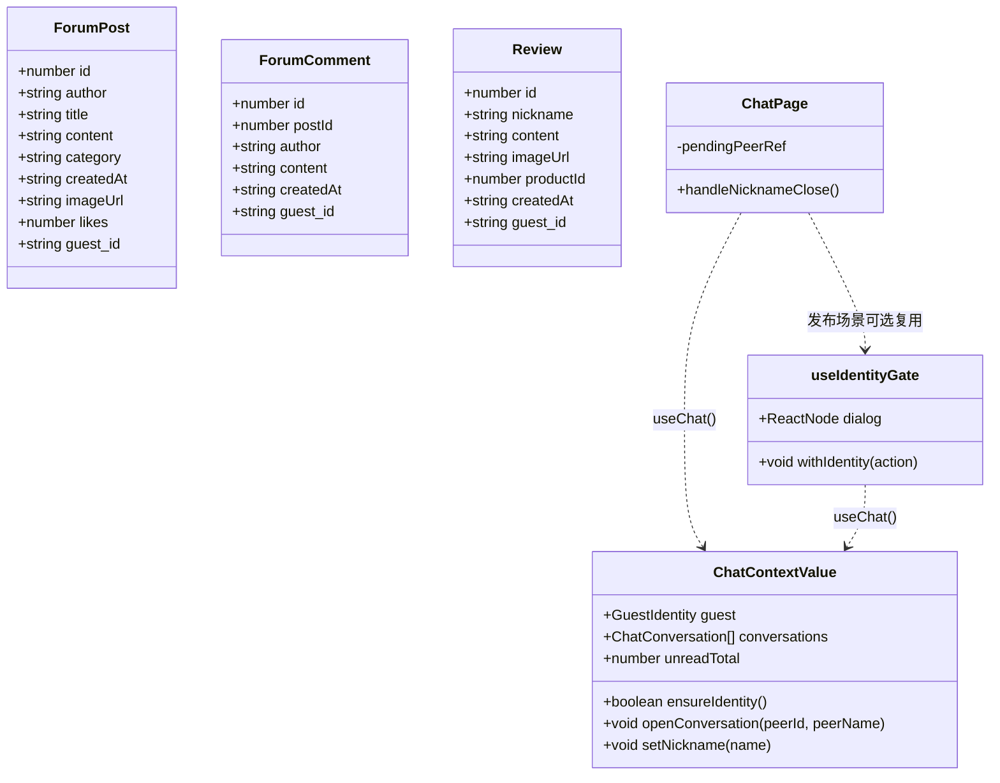
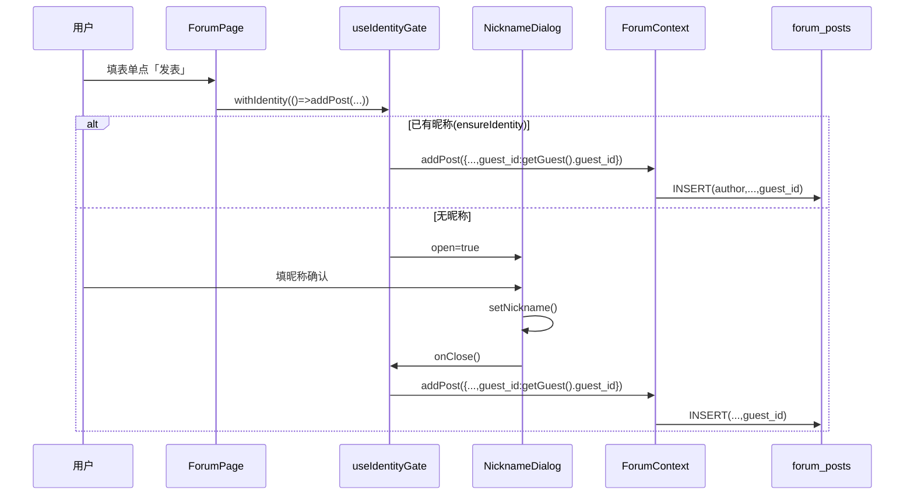
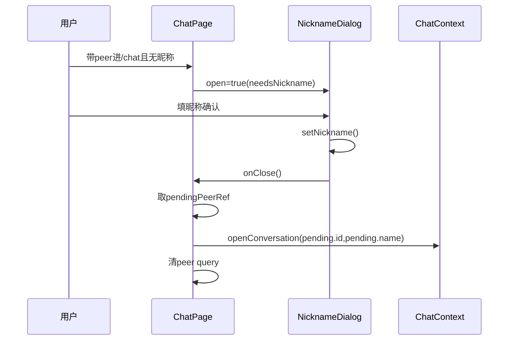
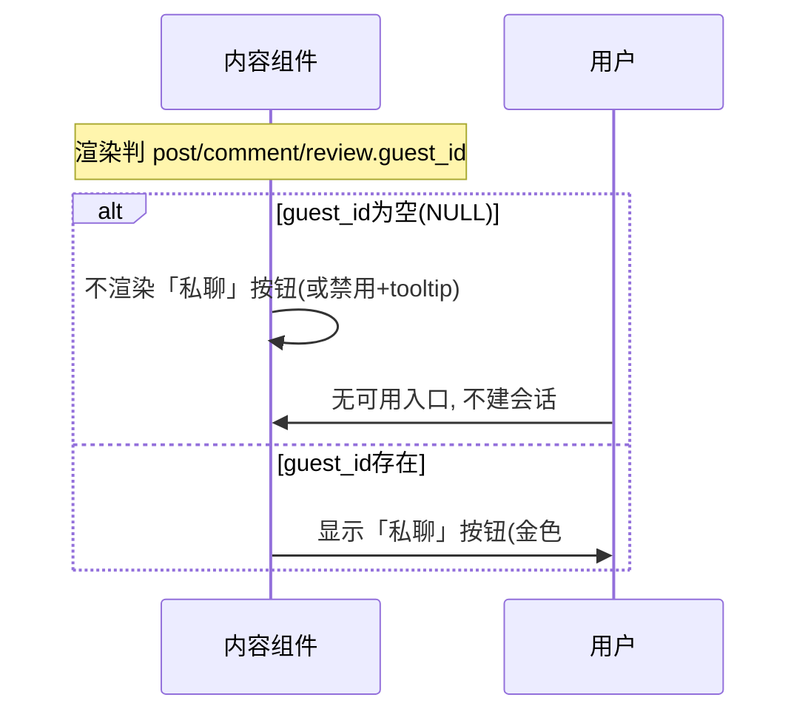
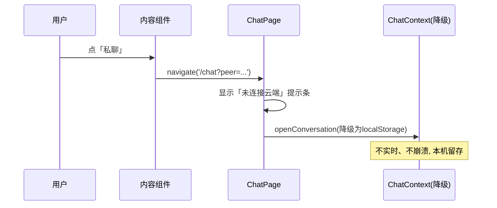
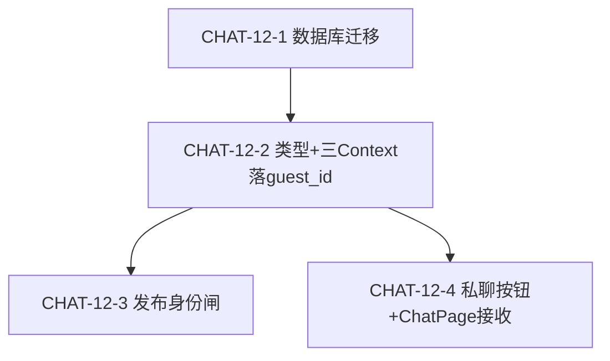

# 明道阁 · 论坛/晒图「私聊」按钮（P2-3 / CHAT-12）增量架构设计

> 作者：架构师 高见远（Gao）
> 适用范围：论坛帖 / 帖子详情 / 评论 / 晒图 作者处「一键私聊」，复用已上线 `chat_messages` 私聊系统
> 关联文档：`docs/incremental-prd-chat-p23.md`（PRD）、`docs/incremental-design-chat.md`（私聊基线设计）
> 状态：设计定稿，待转交工程实现（仅设计，不含实现代码）

---

## 0. 六项关键决策结论（PRD 第 7 节 Q1–Q6，本次拍板）

- **Q1 打开方式 → 方案 B（URL 参数）**：调用方 `navigate('/chat?peer=<guestId>&name=<nickname>')`，由 `ChatPage` 挂载读参后 `openConversation(peer, name)`。优于方案 A 的理由：① 昵称前置（Q2）**集中到 `ChatPage` 一处**，避免四个调用方各自重复判断；② 可深链/可分享，与「确定性会话」天然契合；③ `ChatPage` 本就是昵称前置的 choke point，职责一致；方案 A 每个入口都要 `if(!ensureIdentity()) openDialog else openConversation`，逻辑分散易遗漏。
- **Q2 pending 流转 → ChatPage 改造**：`ChatPage` 用 `useSearchParams()` 读 `peer`/`name`；**有昵称则立即 `openConversation` 并清参**；**无昵称则存 `pendingPeerRef` 并保持 `NicknameDialog` 阻塞**，设完昵称后由 `onClose` 回调自动 `openConversation(pending)` 并清参（详见第 4 节 ③）。
- **Q3 昵称与身份 → 保留每帖自由昵称 + 仅附 guest_id**：展示昵称仍取表单自由文本（`author`/`nickname` 字段，不改既有行为），`guest_id` 取当前聊天身份（`getGuest().guest_id`）。
- **Q4 历史回填 → 不回填**：旧行 `guest_id=NULL` 走 P0-5 降级（按钮隐藏/禁用），无法还原真实身份，即使合成 id 也无人持有、私聊不可达。
- **Q5 匿名发布 → 取消纯匿名，发布必须落 guest_id（行为变更）**：发布入口若 `getGuest()` 无昵称，先经身份闸（`useIdentityGate` 复用 `NicknameDialog`）引导设昵称再发。**这是行为变更，已标注。**
- **Q6 交互形态 → 整页跳 `/chat`**：与「联系客服」一致，不做原地抽屉/弹窗。

---

## 1. 实现方案 + 框架选型

- **技术栈**：延续现有 Vite 6 + React 19 + TS + MUI 6 + Tailwind v4；后端 Supabase（PostgreSQL + Storage + Realtime）。**零新增依赖**。
- **复用范围**：`chat_messages` 单表、`ChatContext.openConversation`、`ChatView`、Realtime、`getConversationId`、后台客服 Tab 一律复用，**不重写聊天逻辑**。
- **核心改造点**：
  1. 三表加可空 `guest_id` 字段并落库（SQL 迁移）。
  2. 发帖/评论/晒图 insert 带 `guest_id`（取自 `getGuest()`）。
  3. 四处作者处加「私聊」按钮：`navigate('/chat?peer=&name=')`。
  4. `ChatPage` 读 URL 参数自动建会话 + 无昵称 pending 流转。
- **身份闸（Q5）**：新增轻量 Hook `useIdentityGate`，统一封装「无昵称→弹 `NicknameDialog`→设完再执行发布动作」，避免在三个发布入口各写一遍。
- **降级**：旧内容 `guest_id=NULL` 按钮隐藏（P0-5）；`isSupabaseConfigured=false` 时按钮仍可点，进 `/chat` 走现有本机降级（P0-6），不崩溃。

---

## 2. 文件列表及相对路径（逐文件职责）

### 新增文件
| 路径 | 职责 |
|---|---|
| `supabase/migrations/chat-p23.sql` | 三表 `ALTER TABLE … ADD COLUMN IF NOT EXISTS guest_id TEXT` + 可选索引（P0-1） |
| `src/hooks/useIdentityGate.ts` | 发布身份闸 Hook：`withIdentity(action)` + 渲染 `<NicknameDialog>`；无昵称时阻塞，设完自动执行（Q5/P0-2 行为变更） |

### 修改文件
| 路径 | 改动 |
|---|---|
| `src/types.ts` | `ForumPost` 增 `guest_id?: string`；`Review` 增 `guest_id?: string`（PRD 误写 `ForumComment` 在 types.ts，实际在 `CommentContext.tsx`） |
| `src/context/CommentContext.tsx` | `ForumComment` 接口增 `guest_id?: string`；`mapDbToComment` 映射 `guest_id`；`addComment` insert 带 `guest_id` |
| `src/context/ForumContext.tsx` | `mapDbToPost` 映射 `guest_id`；`addPost` insert 带 `guest_id`（取自 `getGuest()`/`ensureGuestId()`） |
| `src/context/ReviewContext.tsx` | `mapDbToReview` 映射 `guest_id`；`addReview` insert 带 `guest_id` |
| `src/components/ForumPage.tsx` | 帖卡片作者行加「私聊」按钮（`post.guest_id` 存在且≠自己时显示，P0-3/P1-1）；发帖 `handleSubmit` 经 `useIdentityGate` 闸（Q5）；导入 `useChat` 取 `myId` |
| `src/components/PostDetailDialog.tsx` | 帖子作者行 + 每条评论作者行加「私聊」按钮（`guest_id` 存在且≠自己，P0-3/P1-1）；`handleSubmitComment` 经 `useIdentityGate` 闸（Q5） |
| `src/components/ReviewSection.tsx` | 晒图卡片昵称行加「私聊」按钮（`review.guest_id` 存在且≠自己，P0-3/P1-1）；导入 `useChat` 取 `myId` |
| `src/components/ChatPage.tsx` | `useSearchParams()` 读 `peer`/`name`；有昵称→`openConversation`+清参；无昵称→存 `pendingPeerRef` 保持 `NicknameDialog` 阻塞；`onClose` 自动开 pending 会话（Q1/Q2/P0-4） |
| `src/components/ReviewForm.tsx` | `handleSubmit` 经 `useIdentityGate` 闸（Q5）确保落 `guest_id` 前已设昵称 |

> 注：`reviews` 表当前仓库无独立迁移文件，SQL 用 `IF NOT EXISTS` 防御式执行，幂等安全。

---

## 3. 数据结构与接口

### 3.1 数据库变更（DDL，`supabase/migrations/chat-p23.sql`）
```sql
-- 论坛帖
ALTER TABLE forum_posts ADD COLUMN IF NOT EXISTS guest_id TEXT;
CREATE INDEX IF NOT EXISTS idx_forum_posts_guest_id ON forum_posts(guest_id);

-- 论坛评论
ALTER TABLE forum_comments ADD COLUMN IF NOT EXISTS guest_id TEXT;
CREATE INDEX IF NOT EXISTS idx_forum_comments_guest_id ON forum_comments(guest_id);

-- 晒图
ALTER TABLE reviews ADD COLUMN IF NOT EXISTS guest_id TEXT;
CREATE INDEX IF NOT EXISTS idx_reviews_guest_id ON reviews(guest_id);
```
> 三表 RLS 均为开放（`USING(true)`），加可空列无需改策略。索引为可选（P2-3 不按 guest_id 反查，仅随行读取），建议建（开销小）。

### 3.2 前端类型（仅加 `guest_id?: string`）
```ts
interface ForumPost { /* …既有… */ guest_id?: string }
interface ForumComment { /* …既有… */ guest_id?: string }   // 位于 CommentContext.tsx
interface Review { /* …既有… */ guest_id?: string }
```

### 3.3 复用接口签名（**已 Read `ChatContext.tsx` 确认，勿臆造**）
```ts
// ChatContextValue（useChat() 返回值，节选）
openConversation: (peerId: string, peerName: string) => Promise<void>;
ensureIdentity: () => boolean;          // guest 有非空昵称返回 true
setNickname: (name: string) => void;
guest: { guest_id: string; nickname: string } | null;

// 身份库（src/lib/guestIdentity.ts）
getGuest(): GuestIdentity | null;       // 取 {guest_id, nickname}
ensureGuestId(): string;                // 无则生成并落库（昵称留空），返回 guest_id
```

### 3.4 `useIdentityGate` Hook 接口（新增）
```ts
function useIdentityGate(): {
  withIdentity: (action: () => void) => void; // 有昵称立即执行；无昵称弹窗，设完再执行
  dialog: ReactNode;                          // 需渲染到发布入口组件内的 <NicknameDialog>
};
```

### 3.5 类图（数据模型 + 关键接口）


---

## 4. 程序调用流程

### ① 发帖落 guest_id（含身份闸 Q5/P0-2）


### ② 点击「私聊」按钮 → 跳转并自动建会话（P0-3/4）
```mermaid
sequenceDiagram
    participant U as 用户
    participant C as 内容组件(ForumPage/PostDetail/ReviewSection)
    participant R as useNavigate
    participant CP as ChatPage
    participant CX as ChatContext
    U->>C: 点作者「私聊」(guest_id存在且≠自己)
    C->>R: navigate('/chat?peer=<gid>&name=<nick>')
    R->>CP: 挂载, useSearchParams读peer/name
    alt 已有昵称
        CP->>CX: openConversation(peer,name)
        CX->>CX: convId=getConversationId(myId,peer);setActive;getMessages;markRead
    else 无昵称
        CP->>CP: 存pendingPeerRef, 保持NicknameDialog阻塞
    end
    CP->>CP: setSearchParams({}) 清参
```

### ③ 无昵称前置流转（Q2/P2-2）


### ④ 旧内容降级（P0-5）


### ⑤ 未配置 Supabase 降级（P0-6）


---

## 5. 待明确事项（转回产品或用户）

1. **身份闸文案**：`NicknameDialog` 现有文案「无需注册，填写一个昵称即可发起和接收私信」对「发布前引导」场景是否需轻微区分（如「设置昵称后即可发布并接收私信」）？建议直接复用，不阻塞；若产品要求区分，可在 `useIdentityGate` 传可选 `title` prop。
2. **展示昵称 vs 聊天昵称解耦（Q3 已拍板）**：用户用表单昵称「张三」发帖，但其聊天昵称是「李四」；他人点「私聊」发起后，会话里显示「李四」（聊天昵称）。符合 Q3 决策，已确认，仅需产品知晓。
3. **索引必要性**：PRD 标注可选，建议建立（开销小、便于未来按 guest_id 查询），非阻塞。
4. 其余权衡（会话确定性、应用层隔离铁律、降级持久化）沿用 `incremental-design-chat.md`，本次不变。

---

## 6. 依赖包

- **无新增依赖**。复用现有 `@supabase/supabase-js`（Realtime 内置）、MUI 6、`react-router-dom`、`crypto.randomUUID()`（原生）、`NicknameDialog`（既有）。
- 图片上传复用 Storage `images` 桶（同 ForumPage/ReviewForm）。

---

## 7. 任务列表（有序 + 依赖 + PRD 编号 CHAT-12-*）

| # | 任务 | 依赖 | PRD | 优先级 |
|---|---|---|---|---|
| CHAT-12-1 | 数据库迁移：三表 `ADD COLUMN guest_id`（`supabase/migrations/chat-p23.sql`） | 无 | P0-1 | P0 |
| CHAT-12-2 | 类型扩展 + 三 Context 落 `guest_id`：`src/types.ts`、`src/context/CommentContext.tsx`、`src/context/ForumContext.tsx`、`src/context/ReviewContext.tsx`（`mapDbTo*` 映射 + insert 带 `guest_id`） | CHAT-12-1 | P0-2(数据) | P0 |
| CHAT-12-3 | 发布身份闸：新增 `src/hooks/useIdentityGate.ts`；集成 `src/components/ForumPage.tsx`、`src/components/PostDetailDialog.tsx`、`src/components/ReviewForm.tsx` 的发布动作经 `withIdentity` | CHAT-12-2 | Q5/P0-2(行为变更) | P0 |
| CHAT-12-4 | 私聊入口：四处「私聊」按钮 + 跳转 + `ChatPage` 接收端：`src/components/ForumPage.tsx`、`src/components/PostDetailDialog.tsx`、`src/components/ReviewSection.tsx`、`src/components/ChatPage.tsx`（含 P0-3/4/5、P1-1、P2-1/2、Q1/Q2、P0-6 降级） | CHAT-12-2 | P0-3/4/5,P1-1,P2-1/2,Q1/Q2 | P0 |

> 实现顺序：CHAT-12-1 → CHAT-12-2 →（CHAT-12-3 与 CHAT-12-4 可并行，均依赖 12-2）。
> P1-2（未读角标联动）**无需独立任务**：`openConversation` 已触发 `markRead`，导航角标复用既有 `useChat().unreadTotal`。
> 注：CHAT-12-1（SQL）与 CHAT-12-4 中的 `ChatPage` 改造为单文件任务，是增量特性固有形态，不受通用「每任务≥3文件」约束限制。

### 任务依赖图


---

## 8. 共享知识（跨文件约定）

- **`guest_id` 取用位置**：落库用 `getGuest()?.guest_id ?? ensureGuestId()`（来自 `src/lib/guestIdentity.ts`）；展示昵称仍取表单自由文本（`author`/`nickname`），二者解耦。
- **按钮显示条件**：`guest_id` 非空 **且** `guest_id !== myId`（`myId = useChat().guest?.guest_id`）；否则隐藏（P0-5 旧内容 / P1-1 自身内容）。
- **统一跳转契约**：四处入口**只能用** `navigate('/chat?peer=<gid>&name=<nick>')`，**禁止**直接调 `openConversation`（集中由 `ChatPage` 处理，Q1）。
- **降级判断**：统一用 `src/lib/supabase.ts` 的 `isSupabaseConfigured`；本地模式按钮仍可点，进 `/chat` 走 `localStorage` 降级，不崩溃（P0-6）。
- **会话确定性**：`getConversationId(myId, authorGuestId)`（来自 `chatConstants.ts`），双方互点落入同一会话。
- **应用层隔离铁律（沿用）**：聊天查询只查本人 `guest_id` 相关行，不展示他人会话。
- **行为变更标注（Q5）**：发布前若 `getGuest()` 无昵称，必须先经 `useIdentityGate` 设昵称，取消「纯匿名无身份发布」。

_设计人：高见远（Gao）｜ 仅做设计，不含实现代码。_
