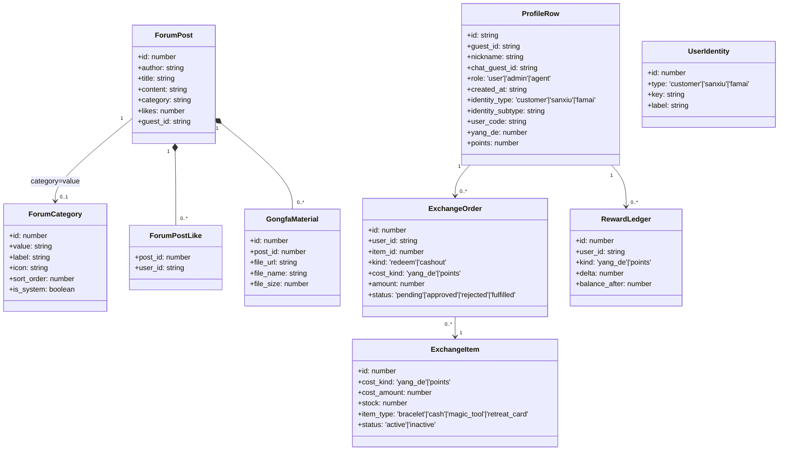
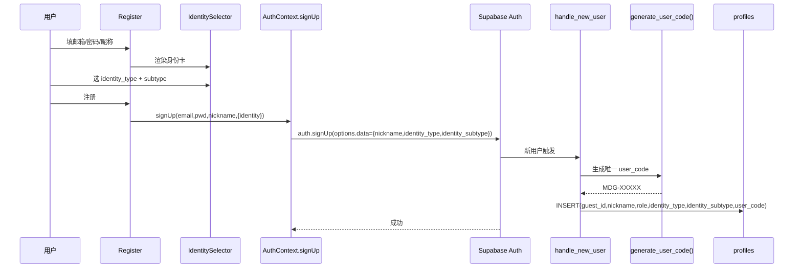
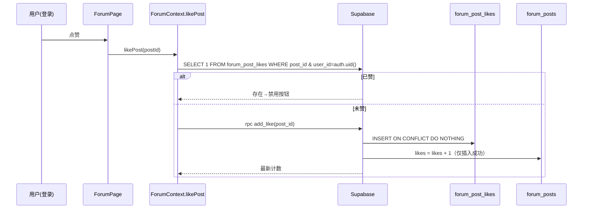
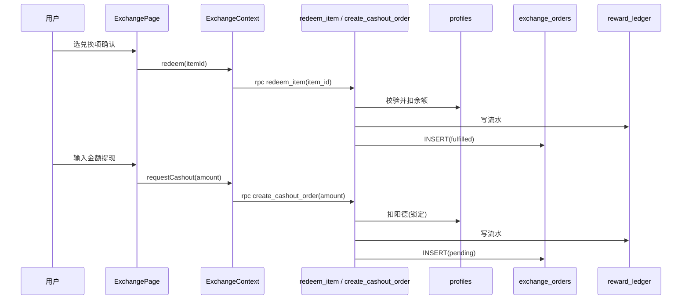
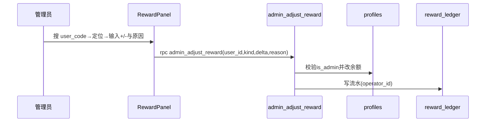
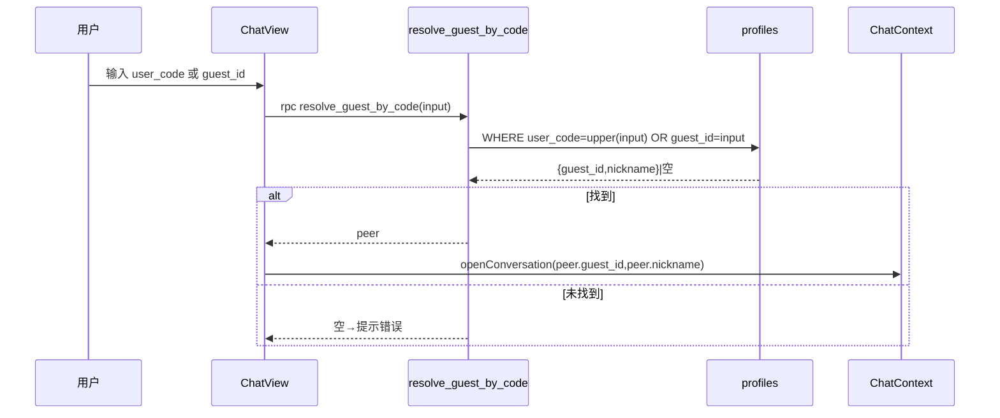
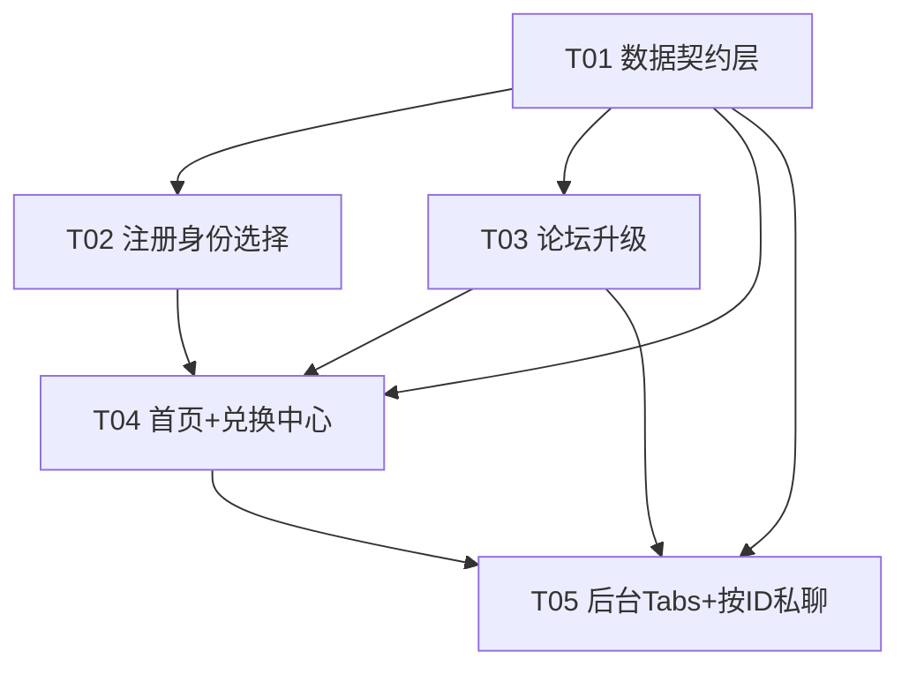

# 明道阁手串电商网站 · 一期架构设计 + 任务分解

> 架构师：高见远（software-architect）
> 项目根目录：`C:\Users\tianl\WorkBuddy\2026-05-26-14-38-13\bracelet-shop`
> 技术栈：Vite6 + React19 + TypeScript + MUI6 + Tailwind CSS v4 + Supabase(PostgreSQL / Auth / Storage / Realtime)
> 范围：PRD 一期 P0-1 ~ P0-14（身份入圈 + 双账户闭环 + 社区化升级）
> 说明：本设计已读取现有 `AuthContext / ForumContext / Register / Navbar / App / AdminPanel / ChatView / ChatContext / profanityFilter` 及 `010~013` 迁移，沿用既有约定，不推翻既有实现。时序图与类图另见 `docs/sequence-diagram.mermaid`、`docs/class-diagram.mermaid`（本文已内嵌）。

---

## 一、实现方案与框架选型

### 1.1 技术难点与选型

| 难点 | 方案 | 说明 |
|------|------|------|
| 身份体系（顾客/散修/法脉 + 细分）落库 | `profiles` 扩展列 + 注册触发器写入 `raw_user_meta_data` | 沿用 `handle_new_user`（010）SECURITY DEFINER 触发器，零新依赖 |
| 双账户（阳德/积分）余额强一致 | `profiles.yang_de / points` 为权威源 + SECURITY DEFINER RPC 原子改余额并写 `reward_ledger` | 避免前端直改导致不一致；并发安全由 DB 事务保证 |
| 论坛分类可后台改（替代硬编码 `FORUM_CATEGORIES`） | 新增 `forum_categories` 表，前端动态加载 | `FORUM_CATEGORIES` 常量仅作降级兜底，逐步废弃 |
| 点赞每人仅一次 | `forum_post_likes(post_id, user_id)` UNIQUE + RPC `add_like` | 计数器 `forum_posts.likes` 仅作展示缓存 |
| 仅管理员删帖 | `forum_posts` DELETE 策略改为仅 `is_admin()` | 覆盖原 owner 可删逻辑 |
| 功法电子书（管理员上传） | `forum_posts(category='gongfa')` + `gongfa_materials` + Storage `gongfa/` 路径 | 复用既有 `images` bucket，新增 `gongfa/` 前缀策略 |
| 按 ID 私聊（兼容 user_code / guest_id） | RPC `resolve_guest_by_code(input)` 解析为 peer `guest_id` | 会话仍走既有 `conversation_id` 派生规则 |
| 私聊页面渲染 | 由 `ChatPage` 读取 `peer/name` 参数后 `resolveById` 再 `openConversation` | 复用 `PrivateChatButton` 既有点对点逻辑 |

**框架结论**：沿用既有栈，**不引入任何新运行时依赖**。`@supabase/supabase-js` 已含 `rpc()` 与 Storage 客户端能力，无需新增包。RPC 命名与权限风格沿用 `011_auth_functions.sql` 的 `SECURITY DEFINER + SET search_path = public`。

### 1.2 架构模式

- **前端**：React 组件 + React Context（`AuthContext` / `ForumContext` / `ChatContext` / 新增 `ExchangeContext`）集中状态，Supabase 直连。
- **后端**：Supabase PostgreSQL + RLS + SECURITY DEFINER 函数（RPC）。无独立后端服务。
- **存储**：Storage bucket `images`，功法电子书走 `gongfa/` 路径（公开读、仅 admin 写）。

---

## 二、文件列表（新建 / 修改，相对路径）

### 新建文件
| 路径 | 作用 |
|------|------|
| `src/lib/identities.ts` | 身份细分常量（前端镜像 `user_identities` 种子）：散修 8 项、法脉 12 项、顾客 |
| `src/lib/reward.ts` | 余额变动 RPC 封装：`admin_adjust_reward` / `redeem_item` / `create_cashout_order` / `approve_cashout` + 类型 |
| `src/lib/exchange.ts` | 兑换项/订单/流水读取封装（列表、我的订单、我的流水） |
| `src/lib/chatResolve.ts` | `resolveById(code)` 封装 RPC `resolve_guest_by_code` |
| `src/components/IdentitySelector.tsx` | 注册页身份选择卡（三选一 + 二级细分下拉） |
| `src/components/PostGongfaDialog.tsx` | 管理员发功法帖 + 上传电子书（关联 `gongfa_materials`） |
| `src/pages/ExchangePage.tsx` | `/exchange` 兑换中心（阳德/积分双 Tab） |
| `src/context/ExchangeContext.tsx` | 兑换/提现/流水状态与 RPC 调用 |
| `src/components/front/SectionStringCollection.tsx` | 首页板块一「串藏雅集」（品鉴手串，CTA→商城） |
| `src/components/front/SectionDaoTreasury.tsx` | 首页板块二「道藏阁」（教材获取=论坛功法，CTA→/forum?category=gongfa） |
| `src/components/front/SectionMeritSquare.tsx` | 首页板块三「积德坊」（功德赚取+兑换入口，CTA→/exchange） |
| `src/components/admin/RewardPanel.tsx` | 后台：用户奖励（搜 user_code + 手动加减阳德/积分 + 流水） |
| `src/components/admin/ExchangeItemPanel.tsx` | 后台：兑换项 CRUD |
| `src/components/admin/GongfaPanel.tsx` | 后台：功法资料（上传电子书 + 管理） |
| `src/components/admin/CategoryPanel.tsx` | 后台：论坛分类 CRUD + 排序 |
| `src/components/admin/CashoutPanel.tsx` | 后台：阳德提现审核（pending→通过/拒绝/标记已兑付） |
| `supabase/migrations/020_profiles_identity_reward.sql` | profiles 扩展列 + `handle_new_user` 扩展 + `user_code` 生成 + 存量回填 |
| `supabase/migrations/021_forum_categories.sql` | `forum_categories` 表 + RLS + 种子（含 `gongfa`） |
| `supabase/migrations/022_gongfa_materials.sql` | `gongfa_materials` 表 + RLS + Storage `gongfa/` 策略 |
| `supabase/migrations/023_exchange_reward.sql` | `reward_ledger` / `exchange_items` / `exchange_orders` / `user_identities` 表 + RLS |
| `supabase/migrations/024_reward_rpc.sql` | 余额/兑换/提现 RPC + `resolve_guest_by_code` |
| `supabase/migrations/025_seed_identities.sql` | `user_identities` 种子数据（散修8/法脉12） |

### 修改文件
| 路径 | 改动要点 |
|------|----------|
| `src/types.ts` | 扩展 `ProfileRow`（identity_type/subtype/user_code/yang_de/points）；`ForumPost` 可选 `isLiked`；新增 `ForumCategoryDB` / `RewardLedger` / `ExchangeItem` / `ExchangeOrder` / `GongfaMaterial` / `UserIdentity` / `ForumPostLike` 类型；保留 `FORUM_CATEGORIES` 作降级常量（标记 deprecated） |
| `src/context/AuthContext.tsx` | `signUp` 接受身份入参写入 `raw_user_meta_data`；`loadProfile` 读取新字段；`getMyGuestId` 不变 |
| `src/pages/Register.tsx` | 昵称后插入 `IdentitySelector`，身份随 `signUp` 提交 |
| `src/context/ForumContext.tsx` | 分类动态加载；`likePost`→查已赞+`add_like`；`deletePost`仅 admin；`addPost` 支持功法帖+电子书上传；违规词作用于功法标题/描述/文件名 |
| `src/components/ForumPage.tsx` | 分类从 `forum_categories` 动态渲染；删除按钮仅 `isAdmin` 可见；功法分类入口；发功法帖入口 |
| `src/components/PostDetailDialog.tsx` | 功法帖展示电子书下载链接 |
| `src/components/Navbar.tsx` | 登录态显示昵称 + 身份标签 + 阳德/积分余额；新增「兑换」导航项 |
| `src/App.tsx` | 接入 `ExchangeContext`；新增 `/exchange` 路由；FrontPage 重组为三板块 |
| `src/components/admin/AdminPanel.tsx` | 新增 Tabs：用户奖励 / 兑换项 / 功法资料 / 论坛分类 / 提现审核 |
| `src/components/ChatView.tsx` | 「新建会话」支持输入 `user_code` 或 `guest_id`，经 `resolveById` 解析后开会话；提示解析失败 |

---

## 三、数据结构与接口（类型 + 表结构 + RPC 签名）

### 3.1 前端核心类型（节选自 `src/types.ts` 扩展）

```ts
// —— profiles 镜像（扩展）——
export interface ProfileRow {
  id: string;
  guest_id: string;
  nickname: string;
  chat_guest_id: string | null;
  role: 'user' | 'admin' | 'agent';
  created_at: string;
  identity_type: 'customer' | 'sanxiu' | 'famai';   // 新增
  identity_subtype: string | null;                  // 新增（散修/法脉二级细分 key）
  user_code: string | null;                         // 新增（MDG-XXXXX）
  yang_de: number;                                  // 新增（阳德）
  points: number;                                   // 新增（积分）
}

// —— 论坛分类（DB 行）——
export interface ForumCategoryDB {
  id: number;
  value: string;        // 唯一，例 'gongfa'
  label: string;
  icon: string;
  sort_order: number;
  is_system: boolean;
}

// —— 功法电子书 ——
export interface GongfaMaterial {
  id: number;
  post_id: number;
  file_url: string;
  file_name: string;
  file_size: number;
  uploaded_by: string;
}

// —— 兑换项 / 订单 / 流水 ——
export type CostKind = 'yang_de' | 'points';
export type ItemType = 'bracelet' | 'cash' | 'magic_tool' | 'retreat_card';
export type OrderStatus = 'pending' | 'approved' | 'rejected' | 'fulfilled';

export interface ExchangeItem {
  id: number;
  title: string;
  description: string | null;
  cost_kind: CostKind;
  cost_amount: number;
  stock: number | null;
  item_type: ItemType;
  status: 'active' | 'inactive';
  sort_order: number;
}
export interface ExchangeOrder {
  id: number;
  user_id: string;
  item_id: number | null;
  kind: 'redeem' | 'cashout';
  cost_kind: CostKind;
  amount: number;
  status: OrderStatus;
  note: string | null;
  operator_id: string | null;
  created_at: string;
}
export interface RewardLedger {
  id: number;
  user_id: string;
  kind: CostKind;
  delta: number;
  balance_after: number;
  reason: string | null;
  operator_id: string | null;
  created_at: string;
}
export interface UserIdentity {
  id: number;
  type: 'customer' | 'sanxiu' | 'famai';
  key: string;
  label: string;
  description: string | null;
  sort_order: number;
}
```

### 3.2 数据库表结构要点

| 表 | 关键列 | 说明 |
|----|--------|------|
| `profiles`（ALTER） | `identity_type text default 'customer'`；`identity_subtype text`；`user_code text unique`；`yang_de int default 0`；`points int default 0` | 由 `handle_new_user` 扩展写入；`user_code` 触发器保证唯一 |
| `forum_categories` | `value text unique`、`label`、`icon`、`sort_order int`、`is_system bool` | 替代 `FORUM_CATEGORIES` 硬编码 |
| `forum_post_likes` | `post_id bigint`、`user_id uuid`、`unique(post_id, user_id)` | 实现每人一次点赞 |
| `gongfa_materials` | `post_id bigint fk forum_posts`、`file_url`、`file_name`、`file_size`、`uploaded_by uuid` | 功法电子书元信息 |
| `reward_ledger` | `user_id`、`kind`、`delta`、`balance_after`、`reason`、`operator_id` | 所有余额变动流水 |
| `exchange_items` | `cost_kind`、`cost_amount`、`stock`、`item_type`、`status`、`sort_order` | 兑换项（admin CRUD） |
| `exchange_orders` | `user_id`、`item_id`、`kind('redeem'/'cashout')`、`cost_kind`、`amount`、`status`、`note`、`operator_id` | 兑换/提现订单 |
| `user_identities` | `type`、`key`、`label`、`description`、`unique(type,key)` | 身份细分种子 |

### 3.3 RPC 签名（SECURITY DEFINER，置于 `024_reward_rpc.sql`）

```sql
-- 内部原子助手：改 profiles 余额 + 写 reward_ledger（被下述公开 RPC 调用）
apply_reward_change(p_user_id uuid, p_kind text, p_delta int, p_reason text, p_operator_id uuid)

-- 管理员手动加减（P0-11）
admin_adjust_reward(p_user_id uuid, p_kind text, p_delta int, p_reason text)
  → guard is_admin(); 调用 apply_reward_change(p_user_id, p_kind, p_delta, p_reason, auth.uid())

-- 兑换实物/法器/清修卡（P0-10）
redeem_item(p_item_id bigint)
  → guard auth.uid() IS NOT NULL
  → 读 item 价格；校验余额；扣 profiles；写流水；INSERT exchange_orders(status='fulfilled')

-- 阳德提现申请（决策4：≥1000 且整千，提交即锁定）
create_cashout_order(p_amount int, p_note text default null)
  → guard auth.uid() NOT NULL
  → 校验 p_amount>=1000 AND p_amount%1000=0 AND p_amount<=我的阳德
  → 扣 yang_de；写流水('阳德提现申请')；INSERT exchange_orders(kind='cashout', status='pending')

-- 管理员处理提现（P0-11/审核流）
approve_cashout(p_order_id bigint, p_action text)  -- 'approve'|'reject'|'fulfill'
  → guard is_admin()
  → reject: 退回阳德（apply_reward_change +amount, '提现驳回退回'），status='rejected'
  → approve/fulfill: status='approved'/'fulfilled'

-- 点赞（P0-6，每人一次）
add_like(p_post_id bigint)
  → guard auth.uid() IS NOT NULL
  → INSERT forum_post_likes ON CONFLICT DO NOTHING；若插入成功则 forum_posts.likes+1；RETURN likes

-- 按 ID 解析私聊对方（P0-9）
resolve_guest_by_code(p_input text) RETURNS TABLE(guest_id text, nickname text)
  → SELECT COALESCE(chat_guest_id, guest_id), nickname
    FROM profiles WHERE user_code = upper(p_input) OR guest_id = p_input
```

### 3.4 类图（Mermaid）



---

## 四、程序调用流程（关键时序，Mermaid）

> 完整多流程版见 `docs/sequence-diagram.mermaid`，以下为核心片段。

### 4.1 注册选身份（P0-1 / P0-2）



### 4.2 点赞每人仅一次（P0-6）



### 4.3 兑换 / 阳德提现（P0-10 / 决策4）



### 4.4 管理员加减阳德/积分（P0-11）



### 4.5 按 ID 私聊（P0-9）



---

## 五、任务列表（有序、含依赖、按实现顺序）

> 遵循架构拆分硬约束：**不超过 5 个宏观任务**，每个任务 ≥3 个文件，T01 为数据/基础设施层，其余尽量仅依赖 T01。下表「宏观任务」为工程落地编排，「涉及文件」给出具体落盘清单。

### 宏观任务（T01–T05）

| 任务 | 名称 | 依赖 | 优先级 | 涉及文件 |
|------|------|------|--------|----------|
| **T01** | 数据契约层（类型 / 常量 / RPC封装 / SQL迁移） | 无 | P0 | `src/types.ts`(改)、`src/lib/identities.ts`(新)、`src/lib/reward.ts`(新)、`src/lib/exchange.ts`(新)、`src/lib/chatResolve.ts`(新)、`supabase/migrations/020~025.sql`(新) |
| **T02** | 注册身份选择 + AuthContext/Profile 扩展 | T01 | P0 | `src/context/AuthContext.tsx`(改)、`src/pages/Register.tsx`(改)、`src/components/IdentitySelector.tsx`(新) |
| **T03** | 论坛升级：动态分类 + 功法栏目 + 点赞一次 + 仅管理员删帖 + 违规词 | T01 | P0 | `src/context/ForumContext.tsx`(改)、`src/components/ForumPage.tsx`(改)、`src/components/PostGongfaDialog.tsx`(新)、`src/components/PostDetailDialog.tsx`(改) |
| **T04** | 首页三板块 + 兑换中心 ExchangePage + ExchangeContext + Navbar | T01, T02, T03 | P0 | `src/pages/ExchangePage.tsx`(新)、`src/context/ExchangeContext.tsx`(新)、`src/components/front/SectionStringCollection.tsx`(新)、`src/components/front/SectionDaoTreasury.tsx`(新)、`src/components/front/SectionMeritSquare.tsx`(新)、`src/App.tsx`(改)、`src/components/Navbar.tsx`(改) |
| **T05** | 后台管理 Tabs + 按 ID 私聊 | T01, T03, T04 | P0 | `src/components/admin/AdminPanel.tsx`(改)、`src/components/admin/RewardPanel.tsx`(新)、`src/components/admin/ExchangeItemPanel.tsx`(新)、`src/components/admin/GongfaPanel.tsx`(新)、`src/components/admin/CategoryPanel.tsx`(新)、`src/components/admin/CashoutPanel.tsx`(新)、`src/components/ChatView.tsx`(改) |

### 任务依赖图（Mermaid graph）



### 各任务要点（工程师落地须知）

- **T01**：先落 SQL（用户手动在 Supabase SQL Editor 按 020→025 顺序执行）；同步扩展 `types.ts` 类型，新增 `identities.ts`（散修8/法脉12 常量）、`reward.ts`（RPC 封装）、`exchange.ts`、`chatResolve.ts`。所有 RPC 用 `supabase.rpc(...)` 调用。
- **T02**：`signUp` 入参扩为 `(email, password, nickname, identity?: {type, subtype})`；`options.data` 写入 `identity_type` / `identity_subtype`；`loadProfile` 的 `select` 增加新列；`IdentitySelector` 数据来自 `src/lib/identities.ts`（前端常量，与 `user_identities` 种子一致）。
- **T03**：`ForumContext` 新增 `categories` 状态 + `loadCategories()`（读 `forum_categories`）；`likePost` 改为先查 `forum_post_likes` 再 `rpc add_like`（游客态降级本地 +1）；`deletePost` 仅 `isAdmin` 可调用（UI 删除按钮 `isAdmin` 可见）；`addPost` 增加可传 `ebookFile`，管理员发功法帖时上传 Storage `gongfa/` 并写 `gongfa_materials`；违规词过滤覆盖功法帖标题/描述/文件名。
- **T04**：`ExchangePage` 双 Tab（阳德兑换：手串 redeem + 现金申请 cashout；积分兑换：法器/清修卡）；余额读 `profile.yang_de/points`（登录后实时）；`ExchangeContext` 封装 `redeem`/`requestCashout`/订单与流水读取；Navbar 显示 `昵称 · 身份标签 · 阳德X/积分Y` 并加「兑换」导航；App 接入 `ExchangeContext` 与 `/exchange` 路由，FrontPage 重组为三板块（串藏雅集/道藏阁/积德坊）。
- **T05**：`AdminPanel` 增加 5 个 Tab（用户奖励/兑换项/功法资料/论坛分类/提现审核）对应 5 个 Panel；`ChatView`「新建会话」增加「按 ID 添加」输入，调用 `resolveById` 解析 `user_code` 或 `guest_id`，失败提示。

---

## 六、依赖包

本期**无新增运行时依赖**。沿用既有：

```
react@^19.0.0                  UI 框架
react-dom@^19.0.0
react-router-dom@^7.15.1       路由（/exchange 新路由）
@mui/material@^6.4.0          组件库
@mui/icons-material@^6.4.0
@supabase/supabase-js@^2.106.2 直连 PG / Auth / Storage / rpc()
@emotion/react @emotion/styled  MUI 样式
tailwindcss@^4.1.0 + @tailwindcss/vite@^4.1.0  样式
vite@^6.3.0 / typescript@^5.8.0 / @vitejs/plugin-react  构建
```

> Storage 上传沿用既有 `supabase.storage.from('images')` 客户端能力，无需额外包。

---

## 七、共享知识（跨文件约定）

1. **全局寻址**：业务一律走 `useAuth().getMyGuestId()`，禁止直读 `localStorage` 或 `profile.guest_id`（既有约定，延续）。
2. **user_code 生成规则**：格式 `MDG-` + 5 位大写字母数字（`[A-Z0-9]{5}`）；由 DB 触发器 `generate_user_code()` 循环生成直至唯一；前端只读展示，**不**自己生成。
3. **余额变动必走 RPC**：任何阳德/积分变动必须经 `admin_adjust_reward` / `redeem_item` / `create_cashout_order` / `approve_cashout` 之一，且**必须**同时写 `reward_ledger`。前端禁止直接 `UPDATE profiles.yang_de/points`。
4. **身份细分常量位置**：前端镜像放 `src/lib/identities.ts`（散修8项、法脉12项、顾客），与 `user_identities` 种子一致；本期不支持自由填写、管理员不做身份 CRUD。
5. **论坛分类动态源**：前端分类来自 `forum_categories` 表（`ForumContext.loadCategories()`）。`src/types.ts` 的 `FORUM_CATEGORIES` 仅作离线/降级兜底，新代码不再硬编码分类。
6. **功法栏目即 `forum_categories.value='gongfa'`**，教材获取复用论坛功法帖 + `gongfa_materials`，不建独立资料库（锁定决策2）。
7. **违规词**：`containsProfanity(text)` 已用于发帖标题/内容/作者；本期 `addPost` 对功法帖额外作用于标题/描述/文件名（P0-8）。
8. **提现规则**：阳德提现最低 1000、必须为整千、无手续费、提交即锁定余额、状态流 `pending→approved/rejected/fulfilled`（决策4）。
9. **Storage**：功法电子书放 `images` bucket 的 `gongfa/` 路径，10MB 限制复用既有逻辑；公开读、仅 admin 写。
10. **角色判定**：前端 `isAdmin` 与 DB `is_admin()` 对齐（role='admin' 或白名单邮箱）；删帖/分类管理/兑换项/功法上传/提现审核均以 `is_admin()` 守卫。

---

## 八、待明确事项（若有）

1. **点赞游客态**：为严格「每人一次」，本设计将点赞限制为**已登录用户**（UNIQUE(post_id,user_id)）。游客态保留本地 +1 不落库（维持现状），但无法保证唯一。是否接受游客不可点赞、或需游客也强制登录后点赞？建议：游客点赞时引导登录。
2. **功法帖作者与展示**：功法帖由管理员发布，`author` 取管理员昵称，`guest_id` 为 `admin`；前台「私聊」按钮对 `admin` 仍可用（联系客服）。是否需隐藏功法帖的私聊按钮？待确认。
3. **兑换发货**：`redeem` 成功后订单 `status='fulfilled'`，但实物/法器无物流跟踪（一期不做）。是否需「待发货/已发货」状态？本期按锁定决策从简，仅 `fulfilled`。
4. **存量 `FORUM_CATEGORIES` 兼容**：新分类表种子含原 4 类 + `gongfa`，建议保留原 4 类 `is_system=true`（UI 禁止删，但可改名/排序）。若希望完全放开管理员删除，请告知。
5. **`user_identities` 与前端常量一致性**：种子数据由 025 写入；前端 `identities.ts` 需手动与之一致。若后续 admin 需改身份细分，需同步两处——本期锁定不做，故未设计同步机制。
6. **`exchange_items.stock` 库存**：列为可空，一期兑换不强制扣库存（redeem 不校验 stock）。若需库存校验，请在 `redeem_item` 增加 `stock` 判断（已预留列）。

---

## 九、SQL 迁移脚本大纲（020–025，用户手动执行顺序）

> 全部在 Supabase SQL Editor 手动执行（不 push）。前缀 `020~025` 接续既有 `010~013`。每个文件可重复执行（幂等：用 `ADD COLUMN IF NOT EXISTS` / `CREATE OR REPLACE` / `ON CONFLICT DO NOTHING`）。执行顺序严格：020 → 021 → 022 → 023 → 024 → 025。

### `020_profiles_identity_reward.sql` — profiles 扩展 + user_code 生成 + 存量回填
```sql
-- 1) 扩展 profiles 列
ALTER TABLE public.profiles
  ADD COLUMN IF NOT EXISTS identity_type TEXT NOT NULL DEFAULT 'customer'
    CHECK (identity_type IN ('customer','sanxiu','famai')),
  ADD COLUMN IF NOT EXISTS identity_subtype TEXT,
  ADD COLUMN IF NOT EXISTS user_code TEXT UNIQUE,
  ADD COLUMN IF NOT EXISTS yang_de INTEGER NOT NULL DEFAULT 0,
  ADD COLUMN IF NOT EXISTS points INTEGER NOT NULL DEFAULT 0;
CREATE UNIQUE INDEX IF NOT EXISTS idx_profiles_user_code ON public.profiles(user_code);

-- 2) user_code 生成函数（循环直至唯一）
CREATE OR REPLACE FUNCTION public.generate_user_code()
RETURNS TEXT LANGUAGE plpgsql AS $$
DECLARE candidate TEXT;
BEGIN
  LOOP
    candidate := 'MDG-' || upper(substring(md5(random()::text) from 1 for 5));
    -- 仅用字母数字：过滤非字母数字后取前5
    candidate := 'MDG-' || regexp_replace(upper(substring(md5(random()::text) from 1 for 8)), '[^A-Z0-9]', '', 'g');
    candidate := 'MDG-' || left(regexp_replace(candidate, 'MDG-', '', 'g'), 5);
    EXIT WHEN NOT EXISTS (SELECT 1 FROM public.profiles WHERE user_code = candidate);
  END LOOP;
  RETURN candidate;
END; $$;

-- 3) 扩展 handle_new_user（在 010 基础上）
CREATE OR REPLACE FUNCTION public.handle_new_user()
RETURNS TRIGGER LANGUAGE plpgsql
SECURITY DEFINER SET search_path = public AS $$
BEGIN
  INSERT INTO public.profiles (id, guest_id, nickname, role, identity_type, identity_subtype, user_code)
  VALUES (
    NEW.id,
    'g_' || gen_random_uuid(),
    COALESCE(NEW.raw_user_meta_data->>'nickname', ''),
    'user',
    COALESCE(NEW.raw_user_meta_data->>'identity_type', 'customer'),
    NEW.raw_user_meta_data->>'identity_subtype',
    public.generate_user_code()
  )
  ON CONFLICT (id) DO NOTHING;
  RETURN NEW;
END; $$;
-- 触发器 on_auth_user_created 已在 010 创建，无需重建

-- 4) 存量回填（无 user_code 的老用户）
DO $$
BEGIN
  UPDATE public.profiles SET user_code = public.generate_user_code()
   WHERE user_code IS NULL;
END $$;
```

### `021_forum_categories.sql` — 论坛分类表 + RLS + 种子
```sql
CREATE TABLE IF NOT EXISTS public.forum_categories (
  id BIGINT GENERATED ALWAYS AS IDENTITY PRIMARY KEY,
  value TEXT UNIQUE NOT NULL,
  label TEXT NOT NULL,
  icon TEXT,
  sort_order INT NOT NULL DEFAULT 0,
  is_system BOOLEAN NOT NULL DEFAULT false,
  created_at TIMESTAMPTZ NOT NULL DEFAULT now()
);
ALTER TABLE public.forum_categories ENABLE ROW LEVEL SECURITY;
CREATE POLICY forum_categories_select ON public.forum_categories FOR SELECT USING (true);
CREATE POLICY forum_categories_admin_w ON public.forum_categories
  FOR ALL USING (public.is_admin()) WITH CHECK (public.is_admin());

INSERT INTO public.forum_categories (value, label, icon, sort_order, is_system) VALUES
  ('paranormal','灵异事件大全','👻',1,true),
  ('handcraft','手串手作','📿',2,true),
  ('culture','国风文化','🏯',3,true),
  ('chat','闲聊灌水','💬',4,true),
  ('gongfa','功法','📜',5,true)
ON CONFLICT (value) DO NOTHING;
```

### `022_gongfa_materials.sql` — 功法电子书表 + RLS + Storage 策略
```sql
CREATE TABLE IF NOT EXISTS public.gongfa_materials (
  id BIGINT GENERATED ALWAYS AS IDENTITY PRIMARY KEY,
  post_id BIGINT NOT NULL REFERENCES public.forum_posts(id) ON DELETE CASCADE,
  file_url TEXT NOT NULL,
  file_name TEXT NOT NULL,
  file_size BIGINT NOT NULL DEFAULT 0,
  uploaded_by UUID REFERENCES auth.users(id),
  created_at TIMESTAMPTZ NOT NULL DEFAULT now()
);
CREATE INDEX IF NOT EXISTS idx_gongfa_post ON public.gongfa_materials(post_id);
ALTER TABLE public.gongfa_materials ENABLE ROW LEVEL SECURITY;
CREATE POLICY gongfa_materials_select ON public.gongfa_materials FOR SELECT USING (true);
CREATE POLICY gongfa_materials_admin_w ON public.gongfa_materials
  FOR ALL USING (public.is_admin()) WITH CHECK (public.is_admin());

-- Storage：复用 images bucket，gongfa/ 路径仅 admin 写、公开读
INSERT INTO storage.buckets (id, name, public) VALUES ('images','images', true)
  ON CONFLICT (id) DO NOTHING;
CREATE POLICY gongfa_upload ON storage.objects
  FOR INSERT TO authenticated WITH CHECK (bucket_id='images' AND name LIKE 'gongfa/%' AND public.is_admin());
CREATE POLICY gongfa_read ON storage.objects
  FOR SELECT USING (bucket_id='images' AND name LIKE 'gongfa/%');
```

### `023_exchange_reward.sql` — 流水/兑换项/订单/身份种子 表 + RLS
```sql
CREATE TABLE IF NOT EXISTS public.reward_ledger (
  id BIGINT GENERATED ALWAYS AS IDENTITY PRIMARY KEY,
  user_id UUID NOT NULL REFERENCES auth.users(id) ON DELETE CASCADE,
  kind TEXT NOT NULL CHECK (kind IN ('yang_de','points')),
  delta INTEGER NOT NULL,
  balance_after INTEGER NOT NULL,
  reason TEXT,
  operator_id UUID,
  created_at TIMESTAMPTZ NOT NULL DEFAULT now()
);
CREATE INDEX IF NOT EXISTS idx_ledger_user ON public.reward_ledger(user_id, created_at DESC);

CREATE TABLE IF NOT EXISTS public.exchange_items (
  id BIGINT GENERATED ALWAYS AS IDENTITY PRIMARY KEY,
  title TEXT NOT NULL,
  description TEXT,
  cost_kind TEXT NOT NULL CHECK (cost_kind IN ('yang_de','points')),
  cost_amount INTEGER NOT NULL,
  stock INTEGER,
  item_type TEXT NOT NULL CHECK (item_type IN ('bracelet','cash','magic_tool','retreat_card')),
  status TEXT NOT NULL DEFAULT 'active' CHECK (status IN ('active','inactive')),
  sort_order INT DEFAULT 0,
  created_at TIMESTAMPTZ NOT NULL DEFAULT now(),
  updated_at TIMESTAMPTZ NOT NULL DEFAULT now()
);

CREATE TABLE IF NOT EXISTS public.exchange_orders (
  id BIGINT GENERATED ALWAYS AS IDENTITY PRIMARY KEY,
  user_id UUID NOT NULL REFERENCES auth.users(id) ON DELETE CASCADE,
  item_id BIGINT REFERENCES public.exchange_items(id) ON DELETE SET NULL,
  kind TEXT NOT NULL CHECK (kind IN ('redeem','cashout')),
  cost_kind TEXT NOT NULL CHECK (cost_kind IN ('yang_de','points')),
  amount INTEGER NOT NULL,
  status TEXT NOT NULL DEFAULT 'pending' CHECK (status IN ('pending','approved','rejected','fulfilled')),
  note TEXT,
  operator_id UUID,
  created_at TIMESTAMPTZ NOT NULL DEFAULT now(),
  updated_at TIMESTAMPTZ NOT NULL DEFAULT now()
);
CREATE INDEX IF NOT EXISTS idx_orders_user ON public.exchange_orders(user_id, created_at DESC);

CREATE TABLE IF NOT EXISTS public.user_identities (
  id BIGINT GENERATED ALWAYS AS IDENTITY PRIMARY KEY,
  type TEXT NOT NULL CHECK (type IN ('customer','sanxiu','famai')),
  key TEXT NOT NULL,
  label TEXT NOT NULL,
  description TEXT,
  sort_order INT DEFAULT 0,
  UNIQUE (type, key)
);

-- RLS（混合：公开读、本人+admin、仅 RPC 写流水）
ALTER TABLE public.reward_ledger ENABLE ROW LEVEL SECURITY;
CREATE POLICY reward_ledger_select ON public.reward_ledger
  FOR SELECT USING (public.is_admin() OR user_id = auth.uid());

ALTER TABLE public.exchange_items ENABLE ROW LEVEL SECURITY;
CREATE POLICY exchange_items_select ON public.exchange_items FOR SELECT USING (true);
CREATE POLICY exchange_items_admin ON public.exchange_items
  FOR ALL USING (public.is_admin()) WITH CHECK (public.is_admin());

ALTER TABLE public.exchange_orders ENABLE ROW LEVEL SECURITY;
CREATE POLICY exchange_orders_select ON public.exchange_orders
  FOR SELECT USING (public.is_admin() OR user_id = auth.uid());
CREATE POLICY exchange_orders_insert ON public.exchange_orders
  FOR INSERT WITH CHECK (auth.uid() IS NOT NULL AND user_id = auth.uid());
CREATE POLICY exchange_orders_admin ON public.exchange_orders
  FOR ALL USING (public.is_admin()) WITH CHECK (public.is_admin());

ALTER TABLE public.user_identities ENABLE ROW LEVEL SECURITY;
CREATE POLICY user_identities_select ON public.user_identities FOR SELECT USING (true);
```

### `024_reward_rpc.sql` — 余额/兑换/提现/点赞/解析 RPC
```sql
-- 内部原子助手
CREATE OR REPLACE FUNCTION public.apply_reward_change(
  p_user_id UUID, p_kind TEXT, p_delta INT, p_reason TEXT, p_operator_id UUID)
RETURNS INTEGER LANGUAGE plpgsql SECURITY DEFINER SET search_path = public AS $$
DECLARE v_balance INTEGER;
BEGIN
  IF p_kind = 'yang_de' THEN
    UPDATE public.profiles SET yang_de = yang_de + p_delta WHERE id = p_user_id RETURNING yang_de INTO v_balance;
  ELSE
    UPDATE public.profiles SET points = points + p_delta WHERE id = p_user_id RETURNING points INTO v_balance;
  END IF;
  INSERT INTO public.reward_ledger (user_id, kind, delta, balance_after, reason, operator_id)
    VALUES (p_user_id, p_kind, p_delta, v_balance, p_reason, p_operator_id);
  RETURN v_balance;
END; $$;

CREATE OR REPLACE FUNCTION public.admin_adjust_reward(
  p_user_id UUID, p_kind TEXT, p_delta INT, p_reason TEXT)
RETURNS INTEGER LANGUAGE plpgsql SECURITY DEFINER SET search_path = public AS $$
BEGIN
  IF NOT public.is_admin() THEN RAISE EXCEPTION 'forbidden'; END IF;
  RETURN public.apply_reward_change(p_user_id, p_kind, p_delta, p_reason, auth.uid());
END; $$;

CREATE OR REPLACE FUNCTION public.redeem_item(p_item_id BIGINT)
RETURNS BIGINT LANGUAGE plpgsql SECURITY DEFINER SET search_path = public AS $$
DECLARE v_user UUID := auth.uid(); v_cost INT; v_kind TEXT; v_order BIGINT;
BEGIN
  IF v_user IS NULL THEN RAISE EXCEPTION 'login required'; END IF;
  SELECT cost_amount, cost_kind INTO v_cost, v_kind FROM public.exchange_items WHERE id = p_item_id AND status='active';
  IF v_cost IS NULL THEN RAISE EXCEPTION 'item not found'; END IF;
  IF v_kind='yang_de' THEN
    IF (SELECT yang_de FROM public.profiles WHERE id=v_user) < v_cost THEN RAISE EXCEPTION 'insufficient yang_de'; END IF;
  ELSE
    IF (SELECT points FROM public.profiles WHERE id=v_user) < v_cost THEN RAISE EXCEPTION 'insufficient points'; END IF;
  END IF;
  PERFORM public.apply_reward_change(v_user, v_kind, -v_cost, '兑换:'||p_item_id, NULL);
  INSERT INTO public.exchange_orders (user_id, item_id, kind, cost_kind, amount, status)
    VALUES (v_user, p_item_id, 'redeem', v_kind, v_cost, 'fulfilled') RETURNING id INTO v_order;
  RETURN v_order;
END; $$;

CREATE OR REPLACE FUNCTION public.create_cashout_order(p_amount INT, p_note TEXT DEFAULT NULL)
RETURNS BIGINT LANGUAGE plpgsql SECURITY DEFINER SET search_path = public AS $$
DECLARE v_user UUID := auth.uid(); v_order BIGINT;
BEGIN
  IF v_user IS NULL THEN RAISE EXCEPTION 'login required'; END IF;
  IF p_amount < 1000 OR p_amount % 1000 <> 0 THEN RAISE EXCEPTION 'amount must be multiple of 1000 and >=1000'; END IF;
  IF (SELECT yang_de FROM public.profiles WHERE id=v_user) < p_amount THEN RAISE EXCEPTION 'insufficient yang_de'; END IF;
  PERFORM public.apply_reward_change(v_user, 'yang_de', -p_amount, '阳德提现申请', NULL);
  INSERT INTO public.exchange_orders (user_id, kind, cost_kind, amount, status, note)
    VALUES (v_user, 'cashout', 'yang_de', p_amount, 'pending', p_note) RETURNING id INTO v_order;
  RETURN v_order;
END; $$;

CREATE OR REPLACE FUNCTION public.approve_cashout(p_order_id BIGINT, p_action TEXT)
RETURNS VOID LANGUAGE plpgsql SECURITY DEFINER SET search_path = public AS $$
DECLARE v_amount INT;
BEGIN
  IF NOT public.is_admin() THEN RAISE EXCEPTION 'forbidden'; END IF;
  SELECT amount INTO v_amount FROM public.exchange_orders WHERE id=p_order_id AND kind='cashout';
  IF v_amount IS NULL THEN RAISE EXCEPTION 'order not found'; END IF;
  IF p_action = 'reject' THEN
    PERFORM public.apply_reward_change(user_id, 'yang_de', v_amount, '提现驳回退回', auth.uid())
      FROM public.exchange_orders WHERE id=p_order_id;
    UPDATE public.exchange_orders SET status='rejected', operator_id=auth.uid(), updated_at=now() WHERE id=p_order_id;
  ELSIF p_action = 'approve' THEN
    UPDATE public.exchange_orders SET status='approved', operator_id=auth.uid(), updated_at=now() WHERE id=p_order_id;
  ELSIF p_action = 'fulfill' THEN
    UPDATE public.exchange_orders SET status='fulfilled', operator_id=auth.uid(), updated_at=now() WHERE id=p_order_id;
  END IF;
END; $$;

CREATE OR REPLACE FUNCTION public.add_like(p_post_id BIGINT)
RETURNS INTEGER LANGUAGE plpgsql SECURITY DEFINER SET search_path = public AS $$
DECLARE v_user UUID := auth.uid(); v_n INTEGER;
BEGIN
  IF v_user IS NULL THEN RAISE EXCEPTION 'login required'; END IF;
  INSERT INTO public.forum_post_likes (post_id, user_id) VALUES (p_post_id, v_user)
    ON CONFLICT DO NOTHING;
  UPDATE public.forum_posts SET likes = likes + 1 WHERE id = p_post_id AND EXISTS (
    SELECT 1 FROM public.forum_post_likes WHERE post_id=p_post_id AND user_id=v_user);
  SELECT likes INTO v_n FROM public.forum_posts WHERE id = p_post_id;
  RETURN v_n;
END; $$;

CREATE TABLE IF NOT EXISTS public.forum_post_likes (
  post_id BIGINT NOT NULL REFERENCES public.forum_posts(id) ON DELETE CASCADE,
  user_id UUID NOT NULL REFERENCES auth.users(id) ON DELETE CASCADE,
  created_at TIMESTAMPTZ NOT NULL DEFAULT now(),
  PRIMARY KEY (post_id, user_id)
);
ALTER TABLE public.forum_post_likes ENABLE ROW LEVEL SECURITY;
CREATE POLICY forum_post_likes_select ON public.forum_post_likes FOR SELECT USING (true);
CREATE POLICY forum_post_likes_insert ON public.forum_post_likes
  FOR INSERT WITH CHECK (auth.uid() IS NOT NULL AND user_id = auth.uid());

-- 论坛删帖策略：仅管理员（覆盖原 owner 可删）
DROP POLICY IF EXISTS forum_posts_delete ON public.forum_posts;
CREATE POLICY forum_posts_delete ON public.forum_posts FOR DELETE USING (public.is_admin());

-- 按 ID 解析私聊对方
CREATE OR REPLACE FUNCTION public.resolve_guest_by_code(p_input TEXT)
RETURNS TABLE(guest_id TEXT, nickname TEXT) LANGUAGE sql STABLE SECURITY DEFINER SET search_path = public AS $$
  SELECT COALESCE(chat_guest_id, guest_id), nickname FROM public.profiles
   WHERE user_code = upper(p_input) OR guest_id = p_input;
$$;
```

### `025_seed_identities.sql` — user_identities 种子
```sql
INSERT INTO public.user_identities (type, key, label, description, sort_order) VALUES
  -- 顾客
  ('customer','customer','顾客','普通结缘用户',1),
  -- 散修 8 项
  ('sanxiu','chuma','出马仙','',1),
  ('sanxiu','yinyang','阴阳先生','',2),
  ('sanxiu','fengshui','风水师','',3),
  ('sanxiu','minjian','民间法教','',4),
  ('sanxiu','mingli','命理师','',5),
  ('sanxiu','nuo','傩师','',6),
  ('sanxiu','xiangmen','香门香童','',7),
  ('sanxiu','daoyi','道医','',8),
  -- 法脉 12 项
  ('famai','longhushan','龙虎山正一道','',1),
  ('famai','maoshan','茅山上清派','',2),
  ('famai','geshan','阁皂山灵宝派','',3),
  ('famai','jingming','西山万寿宫净明道','',4),
  ('famai','quanzhenlongmen','全真龙门派','',5),
  ('famai','quanzhenhuashan','全真华山派','',6),
  ('famai','wudang','武当道三丰派','',7),
  ('famai','shenxiao','神霄派','',8),
  ('famai','qingwei','清微派','',9),
  ('famai','donghua','东华派','',10),
  ('famai','lushan','闾山派','',11),
  ('famai','laoshan','崂山派','',12)
ON CONFLICT (type, key) DO NOTHING;
```

---

### 附：手动执行清单（用户）
1. 打开 Supabase 项目 → SQL Editor。
2. 依次新建并执行：`020` → `021` → `022` → `023` → `024` → `025`。
3. 验证：`SELECT count(*) FROM forum_categories;`（应 5 行）、`SELECT user_code FROM profiles WHERE ... ;`（新注册用户应有 `MDG-` 前缀）。
4. 既有 `013_admin_setup.sql` 客服账号无需变动；如新增管理员，沿用 `is_admin()`（role='admin' 或白名单）。

---

> 设计交付：本文档 + `docs/class-diagram.mermaid` + `docs/sequence-diagram.mermaid` 为架构设计全文。下一步由工程师按 T01→T05 落地，SQL 由用户手动执行。
