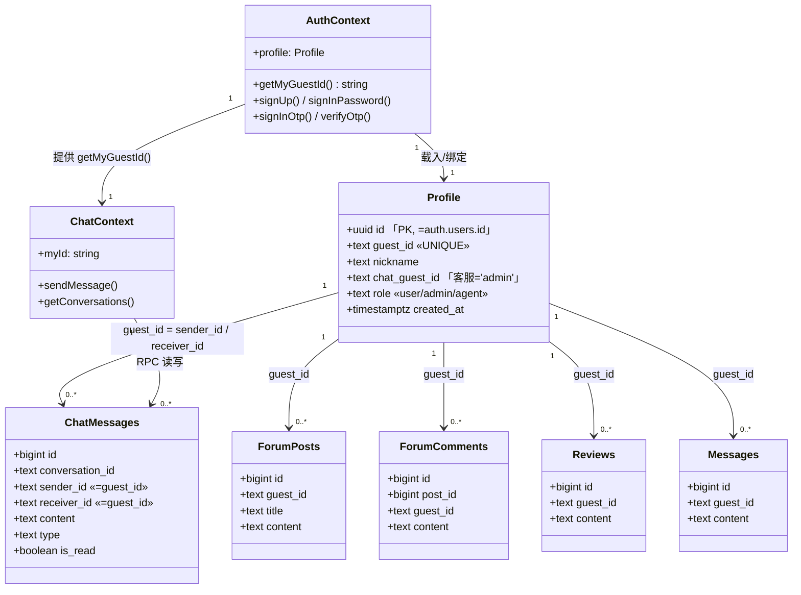
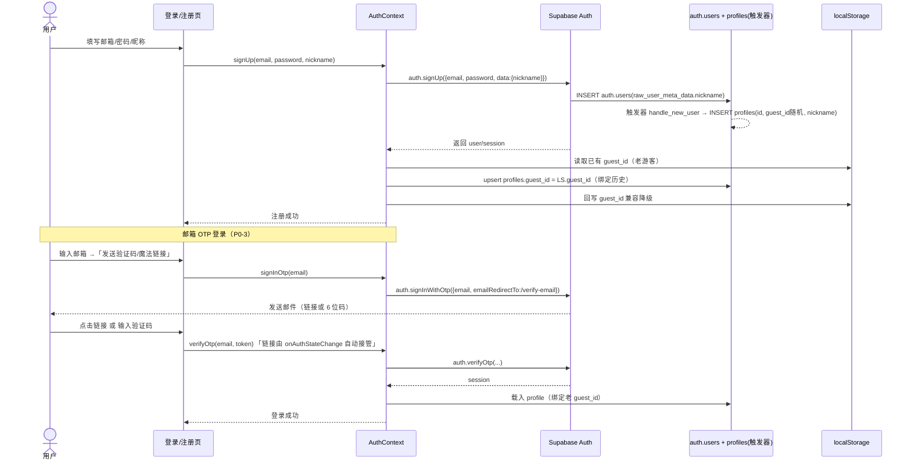
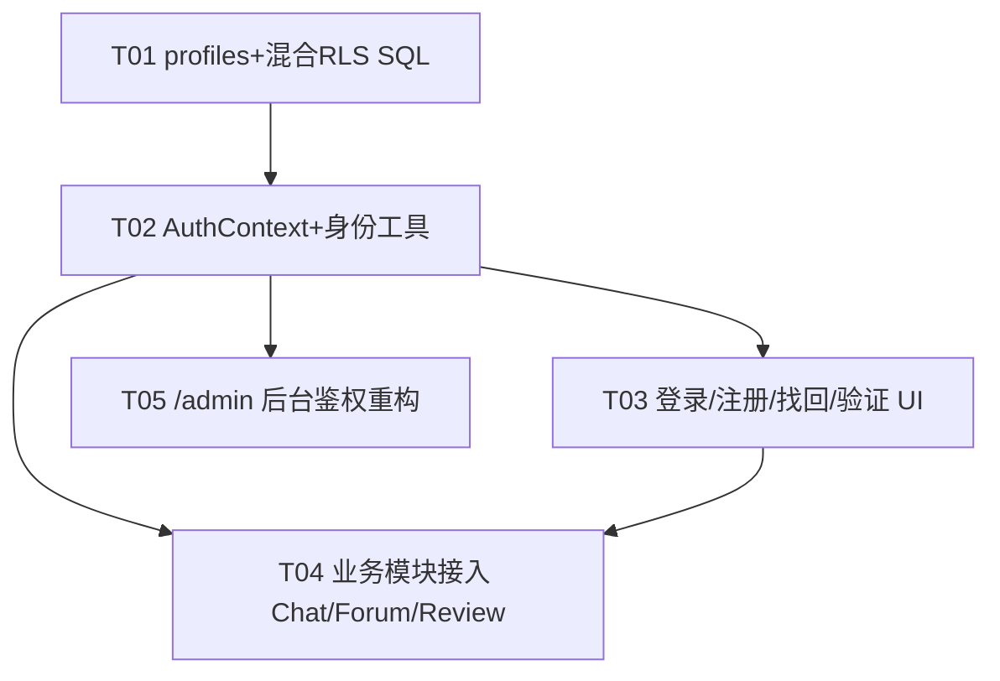

# 明道阁手串电商 · Auth 增量架构设计 + 任务分解

> 作者：架构师 高见远（software-architect）
> 日期：2026-05-26
> 范围：在**不破坏现有私聊/论坛/晒图游客数据**的前提下，引入 Supabase Auth（邮箱密码 + 邮箱 OTP），并以「双字段匿名 + 混合 RLS」方式堵住越权读写漏洞，重构 `/admin` 鉴权。
> 语言：中文（与需求一致）
> 说明：本文含设计、可执行 SQL 草案、Mermaid 类图/时序图/依赖图，**不含最终实现代码**。

---

## 0. 背景与已拍板决策（硬约束）

| 决策 | 内容 |
|---|---|
| A 登录方式 | 邮箱密码 + 邮箱 OTP（魔法链接/验证码）；社交登录（微信/Google）列为 P1 后续，本次不做 |
| B 老数据 | 双字段匿名：新数据落 `auth.uid()`；历史游客数据保留原 `guest_id` 匿名展示，不强制绑定账号 |
| C 强制登录 | 保留游客能力（浏览/发帖/私聊），登录后身份升级，两态共存 |
| D 后台鉴权 | 白名单邮箱（如 `3389675386@qq.com`）+ `auth.uid()`，移除硬编码密码 |
| E 昵称 | 存 `auth.users.raw_user_meta_data`（复用现有昵称 UI 与违规词过滤），并镜像到 `profiles.nickname` |
| F 游客写入 | 保留游客写入，但 SELECT/UPDATE/DELETE 按身份归属收紧（混合 RLS） |

**已读源码核实的现状约束**（设计必须遵守）：
- `src/lib/guestIdentity.ts`：`localStorage` key=`mingdao_guest`，结构 `{guest_id, nickname}`；`generateGuestId()` 用 `crypto.randomUUID()`；换设备即新游客。
- `src/lib/chatConstants.ts`：`ADMIN_GUEST_ID='admin'`、`ADMIN_NAME='明道阁客服'`、`getConversationId(a,b)=[a,b].sort().join('__')`。
- `src/context/ChatContext.tsx`：私聊核心，`myId = guest.guest_id`；`chat_messages.sender_id/receiver_id` 为 TEXT（即 guest_id）；Realtime 通道按 `myId` 区分。
- `src/components/PrivateChatButton.tsx`：跳 `/chat?peer=<guest_id>&name=<nickname>`；`guest_id` 为空或=自己时隐藏。
- `src/components/admin/AdminRoute.tsx`：硬编码 `ADMIN_PASSWORD='mingdao2026'` + `sessionStorage`。
- 数据库：上述表 `guest_id` 均为 TEXT，应用层按 `guest_id` 过滤；RLS 现状为 `USING(true)` 全开放（**隐私漏洞：anon key 可读全部私聊**）。

---

## 1. 实现方案与框架选型

### 1.1 技术挑战
1. **零停机兼容**：老 `guest_id` 行不能丢、不能串号；登录后历史行要「认主」。
2. **隐私漏洞**：`chat_messages` 全开放 RLS，anon key 可读他人私聊 —— 必须收紧。
3. **双态共存**：游客（无 `auth.uid()`）与登录用户（有 `auth.uid()`）都要能发私聊/发帖，但权限不同。
4. **客服兼容**：客服以正式账号登录，但对用户仍显示「明道阁客服」，`getConversationId` 派生需与历史 `admin` 会话兼容。

### 1.2 框架选型（确认）
- **认证**：`@supabase/supabase-js` 的 `auth` API（`signUp` / `signInWithPassword` / `signInWithOtp` / `verifyOtp` / `resetPasswordForEmail` / `signOut` / `onAuthStateChange` / `updateUser`）。**不引入额外认证库**。
- **前端状态**：新增 `AuthContext`（React Context + `useState`/`useEffect`/`useMemo`），与现有 `ChatProvider` 等并列挂载于 `App.tsx`。
- **后端**：复用 Supabase（PostgreSQL + Storage + Realtime + Auth）。**架构模式**：前端分层（Auth 层 → 业务 Context 层 → UI 层）；后端以「表 + 混合 RLS + SECURITY DEFINER 函数」实现行级鉴权。
- **RLS 防递归**：所有 `auth.uid() → guest_id` 映射、admin 判定均用 **`SECURITY DEFINER` + `SET search_path=public`** 的函数，避免策略内查 `profiles` 触发递归 RLS，并保证函数能以表 owner 身份读取 `profiles`。
- **游客读私聊**：直接 `SELECT chat_messages` 对 anon 关闭；改由 **SECURITY DEFINER 函数 `get_my_chat_messages(p_guest_id)`** 按调用方传入的 `guest_id` 返回自己行，从根上堵住「anon 读全部」。

### 1.3 身份映射核心思路
- 引入 `profiles` 表，作为 `auth.uid()` ↔ `guest_id` ↔ `nickname` ↔ `role` 的唯一映射源。
- 注册时 DB 触发器自动建 `profiles`（默认随机 `guest_id`）；前端在 `onAuthStateChange` 后 **upsert `profiles.guest_id = localStorage 里的老 guest_id`**，从而把该浏览器此前的游客历史行「认领」到账号下（满足 B/P0-1/6）。
- `getMyGuestId()` 解析顺序：`profile.chat_guest_id`（客服优先）→ `profile.guest_id` → 降级 `localStorage guest_id`（游客）。这是全局寻址与 RLS 归属的**唯一入口**。

---

## 2. profiles 表设计

### 2.1 Schema
```sql
CREATE TABLE IF NOT EXISTS public.profiles (
  id            UUID PRIMARY KEY REFERENCES auth.users(id) ON DELETE CASCADE,
  guest_id      TEXT UNIQUE NOT NULL,                       -- 登录态稳定身份；RLS 映射键 & 私聊寻址
  nickname      TEXT NOT NULL DEFAULT '',
  chat_guest_id TEXT,                                       -- 客服专用：固定 'admin'，使 getConversationId 兼容
  role          TEXT NOT NULL DEFAULT 'user'
                  CHECK (role IN ('user','admin','agent')),
  created_at    TIMESTAMPTZ NOT NULL DEFAULT now()
);
```

### 2.2 索引
```sql
CREATE UNIQUE INDEX IF NOT EXISTS idx_profiles_guest_id ON public.profiles(guest_id);
CREATE INDEX        IF NOT EXISTS idx_profiles_role     ON public.profiles(role);
```
- `guest_id` 唯一索引：① 保证映射一对一；② RLS 函数 `my_guest_id()` 走索引；③ 历史 `guest_id` 绑定冲突可被捕获（先到先得）。

### 2.3 注册/首次登录时生成并回填 guest_id（推荐做法）
1. `auth.users` 插入触发 `handle_new_user` → 自动 `INSERT profiles(id, guest_id='g_'+uuid, nickname, role='user')`（`ON CONFLICT(id) DO NOTHING` 幂等）。
2. 前端 `onAuthStateChange` 拿到 `user` 后：
   - `const local = getGuest()`（读 `localStorage` 老身份）。
   - 若 `local` 存在 → `supabase.from('profiles').upsert({ id: user.id, guest_id: local.guest_id, nickname: local.nickname })`（**绑定历史**）。
   - 若不存在 → 前端 `ensureGuestId()` 生成并写 `localStorage`，同样 upsert 到 `profiles.guest_id`。
   - 同时把 `guest_id` 写回 `localStorage` 以兼容降级。
3. 昵称：注册时随 `data:{nickname}` 传入 `raw_user_meta_data`，触发器镜像到 `profiles.nickname`；后续改昵称同时更新 `raw_user_meta_data` 与 `profiles.nickname`（见 §4 / §6）。

> **架构权衡**：`guest_id` 由「前端生成 + 绑定」而非纯 DB 默认，是为了让同一浏览器的游客历史无缝认领。代价是需保证 `localStorage guest_id` 唯一（随机 UUID 冲突概率可忽略）。若冲突（极罕见），upsert 会报唯一约束错误，前端降级为新 `guest_id`（历史不合并，符合「换设备即新游客」的既有预期）。

### 2.4 客服账号初始化（P0-8）
客服以正式邮箱账号登录；首次登录后由管理员/迁移脚本把该账号置为 admin 并固定 `chat_guest_id='admin'`：
```sql
-- 见 §3.5（supabase/migrations/013_admin_setup.sql）
UPDATE public.profiles
SET role='admin', chat_guest_id='admin', nickname='明道阁客服'
WHERE id = (SELECT id FROM auth.users WHERE email = '<客服邮箱>');
```
如此 `getMyGuestId()` 对客服返回 `'admin'`，`getConversationId('admin', peerGuestId)` 与历史 `admin` 会话完全兼容，对外仍显示「明道阁客服」。

---

## 3. 混合 RLS 策略（可直接执行的 SQL 草案）

> 三个迁移文件顺序执行：**010** 建表/触发器 → **011** 函数 → **012** 策略（先清旧策略再建新）→ **013** 客服初始化。
> 所有映射/判定函数用 `SECURITY DEFINER` + `SET search_path = public`，规避递归 RLS。

### 3.1 映射与判定函数（`011_auth_functions.sql`）
```sql
-- auth.uid() -> 有效 guest_id（客服优先用 chat_guest_id）
CREATE OR REPLACE FUNCTION public.my_guest_id()
RETURNS TEXT
LANGUAGE sql STABLE SECURITY DEFINER SET search_path = public AS $$
  SELECT COALESCE(chat_guest_id, guest_id) FROM public.profiles WHERE id = auth.uid();
$$;

-- 是否管理员：profiles.role='admin' 或 邮箱在白名单
CREATE OR REPLACE FUNCTION public.is_admin()
RETURNS BOOLEAN
LANGUAGE sql STABLE SECURITY DEFINER SET search_path = public AS $$
  SELECT EXISTS (
    SELECT 1 FROM public.profiles WHERE id = auth.uid() AND role = 'admin'
  ) OR (auth.email() = ANY (ARRAY['3389675386@qq.com']));
$$;

-- 游客/用户自读私聊（SECURITY DEFINER：anon 只能取传入 guest_id 的行，杜绝全表读）
CREATE OR REPLACE FUNCTION public.get_my_chat_messages(p_guest_id TEXT)
RETURNS SETOF public.chat_messages
LANGUAGE sql SECURITY DEFINER SET search_path = public AS $$
  SELECT * FROM public.chat_messages
  WHERE sender_id = p_guest_id OR receiver_id = p_guest_id
  ORDER BY created_at ASC;
$$;

-- 管理员读全部私聊（严格 is_admin 守卫，非 admin 直接抛错）
CREATE OR REPLACE FUNCTION public.get_all_chat_messages()
RETURNS SETOF public.chat_messages
LANGUAGE plpgsql SECURITY DEFINER SET search_path = public AS $$
BEGIN
  IF NOT public.is_admin() THEN RAISE EXCEPTION 'forbidden'; END IF;
  RETURN QUERY SELECT * FROM public.chat_messages ORDER BY created_at DESC;
END;
$$;
```

### 3.2 chat_messages RLS（重点）
```sql
-- SELECT：仅会话双方（auth.uid() 映射到 guest_id 命中 sender/receiver）+ 管理员可见
CREATE POLICY chat_messages_select ON public.chat_messages
  FOR SELECT USING (
    public.is_admin()
    OR (auth.uid() IS NOT NULL
        AND (sender_id = public.my_guest_id() OR receiver_id = public.my_guest_id()))
  );

-- INSERT：登录用户 sender 必须=自己 guest_id；游客(anon)允许任意 guest_id（匿名聊天）
CREATE POLICY chat_messages_insert ON public.chat_messages
  FOR INSERT WITH CHECK ( auth.uid() IS NULL OR sender_id = public.my_guest_id() );

-- UPDATE：仅 owner 或 admin（用于 is_read 标记等）
CREATE POLICY chat_messages_update ON public.chat_messages
  FOR UPDATE USING (
    public.is_admin()
    OR (auth.uid() IS NOT NULL
        AND (sender_id = public.my_guest_id() OR receiver_id = public.my_guest_id()))
  ) WITH CHECK (
    public.is_admin()
    OR (auth.uid() IS NOT NULL
        AND (sender_id = public.my_guest_id() OR receiver_id = public.my_guest_id()))
  );

-- DELETE：仅 owner 或 admin
CREATE POLICY chat_messages_delete ON public.chat_messages
  FOR DELETE USING (
    public.is_admin()
    OR (auth.uid() IS NOT NULL
        AND (sender_id = public.my_guest_id() OR receiver_id = public.my_guest_id()))
  );
```
> 说明：anon **直接** `SELECT chat_messages` 被 `SELECT` 策略拒绝；游客改走 `get_my_chat_messages(p_guest_id)` RPC（见 §6）。这从根上修复「anon key 可读全部私聊」。

### 3.3 forum_posts / forum_comments / reviews / messages RLS
`SELECT` 公开；`INSERT` 允许 anon（游客可发）+ 登录用户强制 `guest_id` 归属；`UPDATE/DELETE` 仅 owner（`auth.uid()→guest_id`）或 admin（**anon 不再能改/删**，收紧旧的全开放）。
```sql
-- messages 表若无 guest_id 先补列
ALTER TABLE public.messages ADD COLUMN IF NOT EXISTS guest_id TEXT;
CREATE INDEX IF NOT EXISTS idx_messages_guest_id ON public.messages(guest_id);

-- 以 forum_posts 为例（forum_comments / reviews / messages 同构，仅表名不同）
CREATE POLICY forum_posts_select ON public.forum_posts FOR SELECT USING (true);

CREATE POLICY forum_posts_insert ON public.forum_posts
  FOR INSERT WITH CHECK ( auth.uid() IS NULL OR guest_id = public.my_guest_id() );

CREATE POLICY forum_posts_update ON public.forum_posts
  FOR UPDATE USING (
    (auth.uid() IS NOT NULL AND guest_id = public.my_guest_id()) OR public.is_admin()
  ) WITH CHECK (
    (auth.uid() IS NOT NULL AND guest_id = public.my_guest_id()) OR public.is_admin()
  );

CREATE POLICY forum_posts_delete ON public.forum_posts
  FOR DELETE USING (
    (auth.uid() IS NOT NULL AND guest_id = public.my_guest_id()) OR public.is_admin()
  );
```
> `forum_comments` / `reviews` / `messages` 把上例 `forum_posts` 替换为对应表名即可（`guest_id` 列均已存在，仅 `messages` 需补列）。

### 3.4 profiles 自身 RLS
```sql
CREATE POLICY profiles_select ON public.profiles FOR SELECT USING (true);  -- 昵称公开展示
CREATE POLICY profiles_insert ON public.profiles FOR INSERT WITH CHECK (auth.uid() = id);
CREATE POLICY profiles_update ON public.profiles
  FOR UPDATE USING (auth.uid() = id OR public.is_admin())
  WITH CHECK (auth.uid() = id OR public.is_admin());
CREATE POLICY profiles_delete ON public.profiles FOR DELETE USING (public.is_admin());
```

### 3.5 客服账号初始化（`013_admin_setup.sql`）
```sql
-- 第一步：Supabase Dashboard 用目标邮箱创建客服账号（邮箱+密码）
-- 第二步：替换 <客服邮箱> 后执行（幂等）
UPDATE public.profiles
SET role = 'admin', chat_guest_id = 'admin', nickname = '明道阁客服'
WHERE id = (SELECT id FROM auth.users WHERE email = '<客服邮箱>');
```

### 3.6 旧策略清理（放进 `012` 头部，保证可重复执行）
```sql
DO $$
DECLARE t text; p text;
BEGIN
  FOREACH t IN ARRAY ARRAY['chat_messages','forum_posts','forum_comments','reviews','messages','profiles'] LOOP
    FOR p IN SELECT policyname FROM pg_policies WHERE schemaname='public' AND tablename=t LOOP
      EXECUTE format('DROP POLICY IF EXISTS %I ON public.%I', p, t);
    END LOOP;
  END LOOP;
END $$;
```

---

## 4. AuthContext 设计

### 4.1 状态与方法（接口）
```ts
interface AuthContextValue {
  session: Session | null;
  user: User | null;
  profile: ProfileRow | null;          // {id, guest_id, nickname, chat_guest_id, role}
  loading: boolean;
  isAuthenticated: boolean;            // !!user
  isAdmin: boolean;                    // profile?.role==='admin' || 白名单（与 is_admin() 对齐）
  isAgent: boolean;                    // profile?.role==='agent' || 有 chat_guest_id
  /** 全局寻址入口：客服→chat_guest_id，登录→guest_id，游客→localStorage */
  getMyGuestId: () => string | null;
  signUp: (email: string, password: string, nickname: string) => Promise<{error?: string}>;
  signInPassword: (email: string, password: string) => Promise<{error?: string}>;
  signInOtp: (email: string) => Promise<{error?: string}>;        // 发魔法链接/验证码
  verifyOtp: (email: string, token: string) => Promise<{error?: string}>;
  resetPassword: (email: string) => Promise<{error?: string}>;
  signOut: () => Promise<void>;
  updateNickname: (name: string) => Promise<void>;                // 同步 raw_user_meta_data + profiles + localStorage
}
```

### 4.2 关键实现要点
- 用 `supabase.auth.onAuthStateChange` 订阅；`SIGNED_IN` 时 `select` 自己的 `profiles` 行载入 `profile`（一次性，避免每次渲染查库）。
- `getMyGuestId()`：
  ```ts
  const getMyGuestId = () => {
    if (profile) return profile.chat_guest_id || profile.guest_id || null; // 客服优先
    return getGuest()?.guest_id ?? null;                                    // 游客降级 localStorage
  };
  ```
- `signUp`：调 `supabase.auth.signUp({ email, password, options:{ data:{ nickname } } })`；错误码经 `authErrors.ts` 映射为中文（如 `email_exists`→「该邮箱已注册」，`weak_password`→「密码至少 6 位」）。
- `signInOtp`：`supabase.auth.signInWithOtp({ email, options:{ emailRedirectTo: `${location.origin}/verify-email` } })`（魔法链接）；同时也支持 `verifyOtp({ email, token, type:'email' })`（验证码）。
- `profile` 载入后执行「绑定老 guest_id」逻辑（见 §2.3）：把 `localStorage.guest_id` upsert 到 `profiles.guest_id`，并回写 `localStorage`。
- `updateNickname`：`supabase.auth.updateUser({ data:{ nickname } })` + `upsert profiles.nickname` + `setNickname`（localStorage），三处一致。

---

## 5. 前端页面 / 组件清单

新增路由（挂在 `App.tsx` 的 `<Routes>` 内，并置于 `<AuthProvider>` 下）：
- `/login` → `src/pages/Login.tsx`：邮箱密码登录 + 「邮箱验证码/魔法链接登录」切换 + 跳注册/找回。
- `/register` → `src/pages/Register.tsx`：邮箱/密码/昵称（复用违规词过滤）注册。
- `/forgot-password` → `src/pages/ForgotPassword.tsx`：发送重置邮件。
- `/verify-email` → `src/pages/VerifyEmail.tsx`：处理魔法链接回调 + 验证码输入。
- 共用：`src/components/AuthCard.tsx`（MUI 卡片布局，沿用现有深色 + 金 `#c9a96e` 主题）。
- `src/components/Navbar.tsx`（改）：登录态菜单 —— 未登录显示「登录/注册」；登录后显示 `Avatar + 昵称 + 下拉（退出 / 进入后台[admin]）`。

`/admin`：`AdminRoute` 重构（见 §7 T05），`AdminPanel` 包裹 `AdminRoute`，客服以 admin 身份收发（见 §6）。

---

## 6. 私聊兼容方案（P0-1/4/8）

- **寻址统一走 `getMyGuestId()`**：`PrivateChatButton`、`ChatContext`、`ChatView` 一律用 `getMyGuestId()` 取得「我的 guest_id」，不再直接用 `guest.guest_id`。游客时它降级为 `localStorage.guest_id`（行为不变）；登录用户时为 `profile.guest_id`；客服时为 `'admin'`。
- **会话派生不变**：`getConversationId(a,b)=[a,b].sort().join('__')` 保持；客服 `getMyGuestId()='admin'`，与历史 `ADMIN_GUEST_ID='admin'` 完全一致 → 老 `admin` 会话不串号、不丢失。
- **读取路径**：
  - 游客：调 `supabase.rpc('get_my_chat_messages', { p_guest_id: getMyGuestId() })`（绕过被拒的直读）。
  - 登录用户：既可走 RPC，也可直读（`SELECT` 策略已放行自己的行）；统一用 RPC 更简洁。
  - 客服/admin：`supabase.rpc('get_all_chat_messages')`（受 `is_admin` 守卫）。
- **发送**：`sender_id = getMyGuestId()`，RLS `INSERT` 对登录用户校验 `sender_id = my_guest_id()`（客服='admin' 通过），游客放行。
- **未读/Realtime**：保持现有应用层过滤（`sender/receiver === myId`）；**建议开启 Realtime RLS**（见 §11 风险点），使 anon 不再收到他人会话的变更事件。

---

## 7. 各模块改造文件列表 + 依赖顺序

| 阶段 | 文件（相对路径） | 动作 | 依赖 |
|---|---|---|---|
| T01 DB | `supabase/migrations/010_auth_profiles.sql` | 新增 | — |
| T01 DB | `supabase/migrations/011_auth_functions.sql` | 新增 | T01-010 |
| T01 DB | `supabase/migrations/012_rls_policies.sql` | 新增（含旧策略清理） | T01-011 |
| T01 DB | `supabase/migrations/013_admin_setup.sql` | 新增（客服初始化，占位邮箱） | T01-012 |
| T02 Auth | `src/context/AuthContext.tsx` | 新增 | T01 |
| T02 Auth | `src/lib/identity.ts` | 新增（ProfileRow 类型 + getMyGuestId 封装） | T01 |
| T02 Auth | `src/lib/authErrors.ts` | 新增（错误码→中文） | — |
| T03 UI | `src/pages/Login.tsx` `src/pages/Register.tsx` `src/pages/ForgotPassword.tsx` `src/pages/VerifyEmail.tsx` | 新增 | T02 |
| T03 UI | `src/components/AuthCard.tsx` | 新增 | — |
| T03 UI | `src/components/Navbar.tsx` | 修改（登录态菜单） | T02 |
| T04 接入 | `src/context/ChatContext.tsx` | 修改（getMyGuestId 寻址 + anon 走 RPC） | T02 |
| T04 接入 | `src/components/PrivateChatButton.tsx` | 修改（用 getMyGuestId 比较） | T02 |
| T04 接入 | `src/hooks/useIdentityGate.tsx` | 修改（登录后写 profile.guest_id 映射） | T02 |
| T04 接入 | `src/components/NicknameDialog.tsx` | 修改（登录态同步 profile+raw_user_meta_data） | T02 |
| T04 接入 | `src/components/ChatView.tsx` | 修改（复制 guest_id / 客服显示） | T02 |
| T04 接入 | `src/App.tsx` | 修改（包 AuthProvider + 加 4 条路由） | T02,T03 |
| T05 后台 | `src/components/admin/AdminRoute.tsx` | 重写（白名单+auth.uid()） | T02 |
| T05 后台 | `src/components/admin/AdminPanel.tsx` | 修改（AdminRoute 包裹 + 客服 admin 身份） | T02,T05-AdminRoute |
| T05 后台 | `src/lib/adminConfig.ts` | 新增（白名单邮箱常量，UI 提示冗余） | — |

**实现先后顺序**：`profiles + RLS SQL 先行（T01）→ AuthContext（T02）→ 登录 UI（T03）→ 各模块接入（T04）→ 后台鉴权（T05）`。

---

## 8. 任务分解（有序 + 依赖，供工程师分批实现）

> 按实现顺序排列；依赖关系见 §9 依赖图。每个任务均含 ≥3 个文件。

- **T01 · 数据库：profiles + 混合 RLS（P0-4/5）**【P0】
  - 源文件：`supabase/migrations/010_auth_profiles.sql`、`011_auth_functions.sql`、`012_rls_policies.sql`、`013_admin_setup.sql`
  - 依赖：无
  - 交付：建 `profiles` 表+触发器；`my_guest_id()`/`is_admin()`/`get_my_chat_messages()`/`get_all_chat_messages()`；6 张表混合 RLS（先清旧策略）；客服初始化模板。
- **T02 · AuthContext + 身份工具层（P0-2/3/4）**【P0】
  - 源文件：`src/context/AuthContext.tsx`、`src/lib/identity.ts`、`src/lib/authErrors.ts`
  - 依赖：T01
  - 交付：`onAuthStateChange` 订阅、加载 `profile`、绑定老 `guest_id`、`getMyGuestId()`、`signUp/signInPassword/signInOtp/verifyOtp/resetPassword/signOut/updateNickname`。
- **T03 · 登录/注册/找回/验证 页面与导航（P0-2/3）**【P0】
  - 源文件：`src/pages/Login.tsx`、`src/pages/Register.tsx`、`src/pages/ForgotPassword.tsx`、`src/pages/VerifyEmail.tsx`、`src/components/AuthCard.tsx`、`src/components/Navbar.tsx`（改）
  - 依赖：T02
  - 交付：4 个页面 + 共用卡片 + Navbar 登录态菜单；中文错误提示。
- **T04 · 业务模块接入（私聊/论坛/晒图兼容，P0-1/4/6）**【P0】
  - 源文件：`src/context/ChatContext.tsx`（改）、`src/components/PrivateChatButton.tsx`（改）、`src/hooks/useIdentityGate.tsx`（改）、`src/components/NicknameDialog.tsx`（改）、`src/components/ChatView.tsx`（改）、`src/App.tsx`（改）
  - 依赖：T02
  - 交付：全局 `getMyGuestId()` 寻址；游客走 RPC 读私聊；昵称同步 profile+raw_user_meta_data；App 包 AuthProvider + 4 路由。
- **T05 · /admin 后台鉴权重构（P0-7/8）**【P0】
  - 源文件：`src/components/admin/AdminRoute.tsx`（重写）、`src/components/admin/AdminPanel.tsx`（改）、`src/lib/adminConfig.ts`（新增）
  - 依赖：T02
  - 交付：移除硬编码密码，改用白名单邮箱 + `auth.uid()`；客服以 admin 账号登录、`chat_guest_id='admin'` 对外显「明道阁客服」、`getConversationId` 兼容。

> P1（本次不做，预留）：社交登录（微信/Google）接口；`AuthProvider` 预留 `signInWithOAuth` 占位。

---

## 9. 依赖包

```
@supabase/supabase-js   # 已安装；仅用其 auth API，无需新增后端框架
```
无需新增第三方包。前端继续复用已装的 `react`、`react-router-dom`、`@mui/material`、`tailwindcss`、`react`。

---

## 10. 共享约定（跨模块必须遵守）

- **映射规则**：`auth.uid() → profiles.guest_id`（普通用户）/ `profiles.chat_guest_id`（客服，优先）。所有「我是谁」的判定只允许走 `getMyGuestId()`，禁止业务代码直接读 `localStorage` 或 `profile.guest_id` 做寻址。
- **RLS 函数命名**：`my_guest_id()`（映射）、`is_admin()`（判定）、`get_my_chat_messages(p_guest_id)`（游客/用户自读）、`get_all_chat_messages()`（admin 全读）。新增映射需求优先扩展这些函数，勿在策略里直接 `SELECT profiles`。
- **降级顺序**：`profile.chat_guest_id → profile.guest_id → localStorage.guest_id → null`。
- **昵称权威源**：`profiles.nickname` 为权威；`auth.users.raw_user_meta_data.nickname` 仅作 Supabase 默认展示；`localStorage.nickname` 仅游客态使用。改昵称三者同步（经 `updateNickname`）。
- **游客写入**：`INSERT` 允许 anon，但登录用户强制 `guest_id = my_guest_id()`（防冒充）。`UPDATE/DELETE`：anon 一律拒绝，仅 owner（auth 映射）或 admin。
- **私聊读取**：游客/登录用户走 `get_my_chat_messages(p_guest_id)`；admin 走 `get_all_chat_messages()`；**禁止**前端对 `chat_messages` 直接 `.select()` 全表。

---

## 11. 待明确事项（需用户/工程师确认）

1. **客服账号邮箱与创建方**：`<客服邮箱>` 具体是什么？由谁在 Supabase Dashboard 创建？密码策略？（影响 `013_admin_setup.sql` 与白名单）
2. **OTP 形态**：本次默认「魔法链接」还是「6 位验证码」？Supabase 两者皆支持，但 `/verify-email` UI 与 `emailRedirectTo` 配置不同，需产品定。
3. **Realtime RLS 风险（重要）**：Supabase Realtime `postgres_changes` 对 anon 是否受 RLS 约束，取决于是否开启「Realtime RLS」。若未开启，anon 订阅仍会收到他人私聊变更事件，等于变相泄露。**建议开启 Realtime RLS**；开启后游客将无法收到自己会话的实时推送，需改由登录态或前端轮询兜底。需团队决策采用哪种。
4. **跨设备历史合并边界**：登录后 `getMyGuestId()` 以服务端 `profile.guest_id` 为准，新设备（localStorage 是新 guest_id）看不到旧设备历史 —— 与现有「换设备即新游客」一致，确认可接受。
5. **历史无 guest_id 的旧行**：早期 forum_posts/comments/reviews 可能 `guest_id` 为空（旧内容未落身份），`PrivateChatButton` 已对其隐藏；这些行 owner 编辑会因 `guest_id≠profile.guest_id` 被拒（安全，符合预期），确认无需回填。
6. **白名单扩展机制**：`is_admin()` 内邮箱白名单当前硬编码 `3389675386@qq.com`；后续新增管理员走 `profiles.role='admin'`（由现有 admin 设）还是改 SQL？建议以 `role='admin'` 为主、白名单仅兜底。
7. **站点回调配置**：魔法链接 `emailRedirectTo` 需 `mingdaoge.top/verify-email`，需在 Supabase（Site URL / Redirect URLs）与 Vercel 环境变量配置，需团队提供域名与生产环境变量。

---

## 附录 · Mermaid 图

> 类图见 `docs/class-diagram.mermaid`；时序图（注册/登录 + 游客↔登录切换）见 `docs/sequence-diagram.mermaid`。以下为内联副本。

### A. 数据模型关系类图


### B. 注册 / 登录（邮箱密码 + OTP）时序图


### C. 游客 ↔ 登录态 切换 / 身份解析流程
```mermaid
flowchart TD
    START[获取「我的身份」] --> AUTH{已登录?}
    AUTH -- 否（游客） --> GUEST[getMyGuestId = localStorage.guest_id]
    AUTH -- 是 --> CHAT{profile.chat_guest_id 非空?}
    CHAT -- 是（客服） --> AGENT[getMyGuestId = 'admin']
    CHAT -- 否（普通用户） --> USER[getMyGuestId = profile.guest_id]

    GUEST --> G1[游客态：可浏览/发帖/私聊]
    G1 --> G2[私聊走 RPC get_my_chat_messages(localStorage.guest_id)]
    AGENT --> A1[客服态：对外显示「明道阁客服」]
    A1 --> A2[getConversationId('admin', peer) 兼容历史 admin 会话]
    A2 --> A3[私聊走 RPC get_all_chat_messages（is_admin 守卫）]
    USER --> U1[登录态：profile.guest_id = 老 guest_id]
    U1 --> U2[历史 forum/chat 行经 RLS 认主，可见/可编辑]
    U2 --> U3[私聊走 RPC get_my_chat_messages(profile.guest_id)]
```

### D. 任务依赖图

