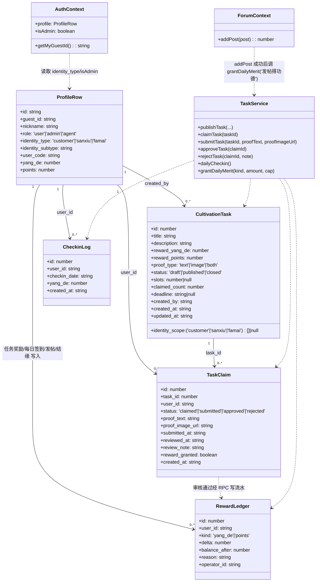
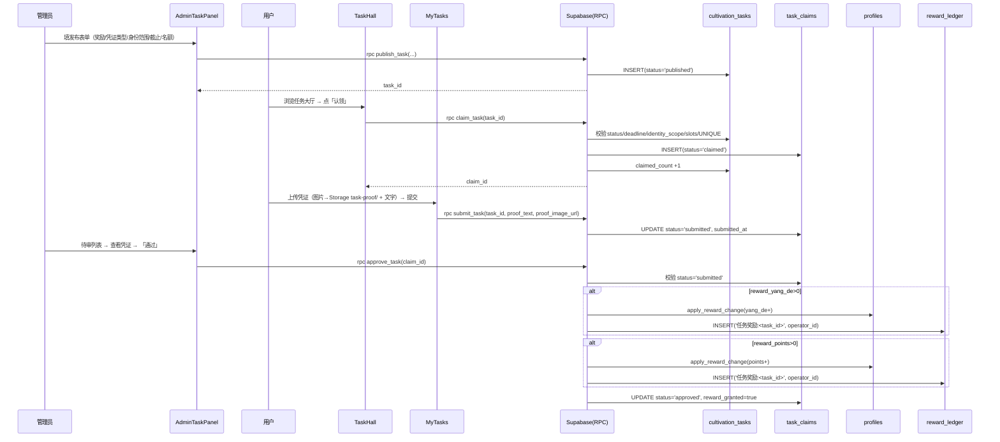
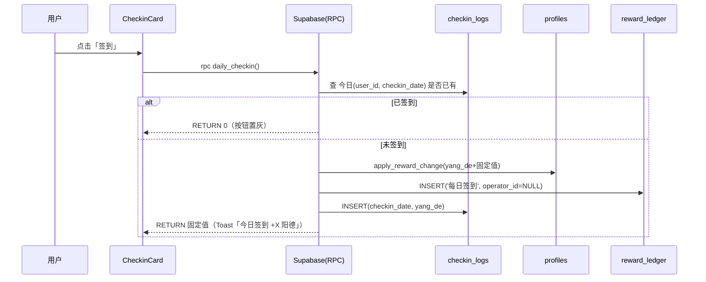
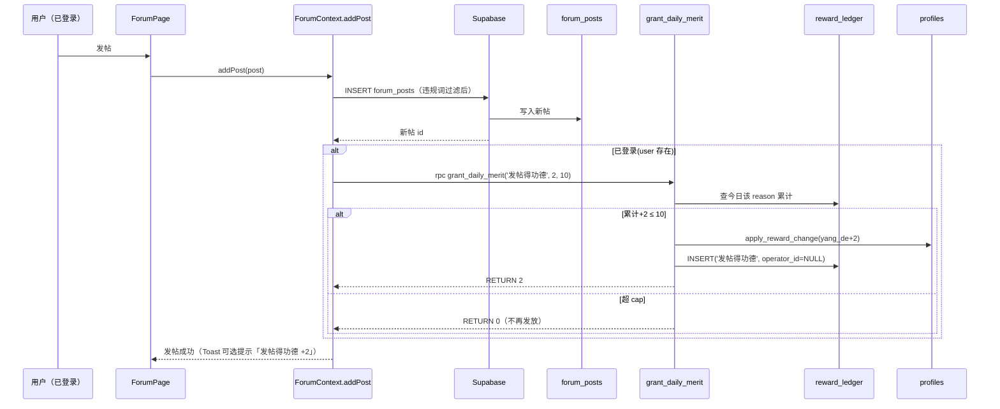
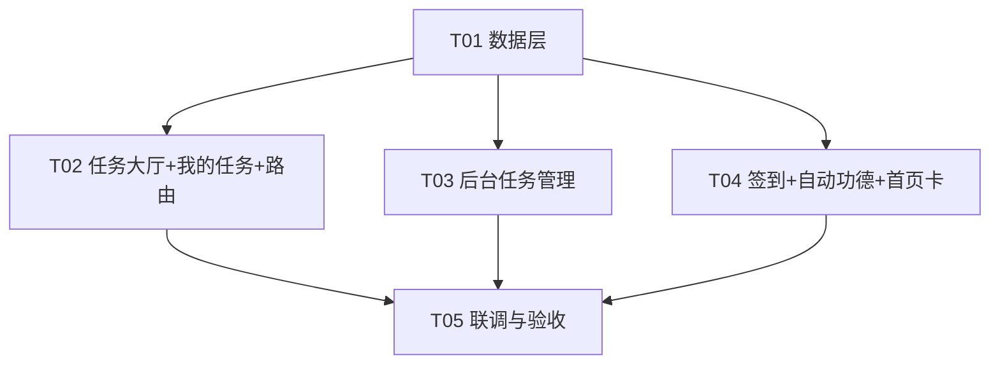

# 明道阁 · P2 修行任务派发系统 · 架构设计 + 任务分解

> 架构师：高见远（software-architect）
> 项目根目录：`bracelet-shop/`（git: `main`）
> 技术栈：Vite6 + React19 + TypeScript + MUI6 + Tailwind v4 + Supabase(PostgreSQL / Auth / Storage / Realtime)
> 范围：P2 修行任务派发系统（派发闭环 + 自动功德：签到 / 发帖 / 结缘）
> 说明：本文**严格沿用一期 `docs/system_design.md` 的约定与风格**（表命名、RPC 风格、RLS 模式、前端目录结构、`apply_reward_change` 与 `is_admin()` 复用、Storage `images` bucket）。类图 / 时序图内嵌于本文 D / E 节。

---

## A. 实现方案 + 框架选型

### A.1 技术难点与选型

| 难点 | 方案 | 说明 |
|------|------|------|
| 任务派发闭环（发布→认领→凭证→审核→发奖） | 三表 + 7 个 SECURITY DEFINER RPC | 沿用 `024_reward_rpc.sql` 的 `apply_reward_change` 原子发奖；审核通过时依次发放阳德/积分并写 `reward_ledger`，前端绝不直接改 `profiles` |
| 奖励「阳德 + 积分混合」 | `cultivation_tasks` 双列 `reward_yang_de` / `reward_points`（默认 0） | 审核通过时对 >0 的列各调一次 `apply_reward_change`；reason=`任务奖励:<task_id>`，operator_id=当前管理员 |
| 顾客「可见不可参与」 | `identity_scope text[]`（NULL=全员可见）；`claim_task` 内校验 | 顾客在任务大厅能看到全员任务，但认领时若 `identity_scope` 不含 `customer` 直接报错「顾客不可参与修行任务」 |
| 凭证图片上传 | 复用 `images` bucket 的 `task-proof/` 路径 | 新增两条 Storage 策略（登录用户可写、公开读），不新建 bucket |
| 高频自动功德防刷 | `grant_daily_merit(p_kind, p_amount, p_daily_cap)` | 查 `reward_ledger` 当日该 reason 累计，超 cap 返回 0 不发；reason 约定「发帖得功德 / 结缘得功德」，operator_id=NULL |
| 每日签到防重复 | `checkin_logs UNIQUE(user_id, checkin_date)` + `daily_checkin()` 先查后插 | 已签到返回 0，不重复发奖 |

**框架结论**：**不引入任何新运行时依赖**。`@supabase/supabase-js` 已含 `rpc()` 与 Storage 客户端能力。RPC 命名与权限风格沿用 `011/024`：`SECURITY DEFINER + SET search_path = public`。前端新增一个轻量数据层 `src/lib/task.ts`（镜像 `src/lib/reward.ts`）封装 RPC 调用。

### A.2 架构模式

- **前端**：React 组件 + 现有 Context（`AuthContext` / `ForumContext`）；新功能数据访问统一走 `src/lib/task.ts` 的 `supabase.rpc(...)`，不直接改表。
- **后端**：Supabase PostgreSQL + RLS + SECURITY DEFINER 函数（RPC）。无独立后端服务。
- **存储**：Storage bucket `images`，凭证走 `task-proof/` 路径（公开读、仅登录用户写）；功法电子书仍走 `gongfa/`（一期）。
- **路由**：沿用 `App.tsx` 的 `lazy` + `<Suspense>` 模式，新增 `/tasks`、`/tasks/mine` 两条路由。

---

## B. 数据库 Schema（三张表）

### B.1 `cultivation_tasks`（修行任务定义）

| 字段 | 类型 | 约束 / 说明 |
|------|------|-------------|
| `id` | BIGINT | `GENERATED ALWAYS AS IDENTITY` PK |
| `title` | TEXT | NOT NULL |
| `description` | TEXT | NULL |
| `reward_yang_de` | INTEGER | NOT NULL DEFAULT 0（阳德奖励，可混合） |
| `reward_points` | INTEGER | NOT NULL DEFAULT 0（积分奖励，可混合） |
| `proof_type` | TEXT | NOT NULL DEFAULT 'both' CHECK IN ('text','image','both') |
| `identity_scope` | TEXT[] | NULL=**全员可见**（顾客也能在任务大厅看到）；非空则限定 `{customer,sanxiu,famai}` 子集 |
| `status` | TEXT | NOT NULL DEFAULT 'draft' CHECK IN ('draft','published','closed') |
| `slots` | INTEGER | NULL=不限；非空需 >0（名额上限） |
| `claimed_count` | INTEGER | NOT NULL DEFAULT 0（已认领人数，**认领成功时 +1**，用于名额上限与展示） |
| `deadline` | TIMESTAMPTZ | NULL=长期有效 |
| `created_by` | UUID | REFERENCES auth.users(id) |
| `created_at` / `updated_at` | TIMESTAMPTZ | DEFAULT now() |

索引：`idx_cultivation_tasks_status(status)`、`idx_cultivation_tasks_created(created_at DESC)`、`idx_cultivation_tasks_scope USING gin(identity_scope)`。

### B.2 `task_claims`（用户认领 / 凭证 / 审核）

| 字段 | 类型 | 约束 / 说明 |
|------|------|-------------|
| `id` | BIGINT | PK |
| `task_id` | BIGINT | FK → cultivation_tasks(id) ON DELETE CASCADE |
| `user_id` | UUID | FK → auth.users(id) ON DELETE CASCADE |
| `status` | TEXT | NOT NULL DEFAULT 'claimed' CHECK IN ('claimed','submitted','approved','rejected') |
| `proof_text` | TEXT | 文字凭证 |
| `proof_image_url` | TEXT | 图片凭证（Storage `task-proof/`） |
| `submitted_at` | TIMESTAMPTZ | NULL |
| `reviewed_at` | TIMESTAMPTZ | NULL |
| `review_note` | TEXT | 审核意见（驳回原因 / 通过备注） |
| `reward_granted` | BOOLEAN | NOT NULL DEFAULT false |
| `created_at` | TIMESTAMPTZ | DEFAULT now() |

约束：`UNIQUE(task_id, user_id)`（每用户每任务一次有效认领）。
索引：`idx_task_claims_user(user_id)`、`idx_task_claims_task(task_id)`、`idx_task_claims_status(status) WHERE status='submitted'`（待审列表）。

### B.3 `checkin_logs`（每日签到）

| 字段 | 类型 | 约束 / 说明 |
|------|------|-------------|
| `id` | BIGINT | PK |
| `user_id` | UUID | FK → auth.users(id) ON DELETE CASCADE |
| `checkin_date` | DATE | NOT NULL DEFAULT current_date |
| `yang_de` | INTEGER | NOT NULL DEFAULT 0（本次签到获得阳德） |
| `created_at` | TIMESTAMPTZ | DEFAULT now() |

约束：`UNIQUE(user_id, checkin_date)`（每用户每日一次）。索引：`idx_checkin_logs_user(user_id, checkin_date DESC)`。

### B.4 RLS 策略

```sql
-- cultivation_tasks：已发布全员可读；admin 可见/改全部
ALTER TABLE cultivation_tasks ENABLE ROW LEVEL SECURITY;
CREATE POLICY cultivation_tasks_select ON cultivation_tasks
  FOR SELECT USING (status = 'published' OR public.is_admin());
CREATE POLICY cultivation_tasks_admin ON cultivation_tasks
  FOR ALL USING (public.is_admin()) WITH CHECK (public.is_admin());

-- task_claims：本人可读/写自己的；admin 全权限
ALTER TABLE task_claims ENABLE ROW LEVEL SECURITY;
CREATE POLICY task_claims_select ON task_claims
  FOR SELECT USING (user_id = auth.uid() OR public.is_admin());
CREATE POLICY task_claims_insert ON task_claims
  FOR INSERT WITH CHECK (auth.uid() IS NOT NULL AND user_id = auth.uid());
CREATE POLICY task_claims_update ON task_claims
  FOR UPDATE USING (user_id = auth.uid() OR public.is_admin())
  WITH CHECK (user_id = auth.uid() OR public.is_admin());
CREATE POLICY task_claims_delete ON task_claims FOR DELETE USING (public.is_admin());

-- checkin_logs：本人 + admin
ALTER TABLE checkin_logs ENABLE ROW LEVEL SECURITY;
CREATE POLICY checkin_logs_select ON checkin_logs
  FOR SELECT USING (user_id = auth.uid() OR public.is_admin());
CREATE POLICY checkin_logs_insert ON checkin_logs
  FOR INSERT WITH CHECK (auth.uid() IS NOT NULL AND user_id = auth.uid());
CREATE POLICY checkin_logs_delete ON checkin_logs FOR DELETE USING (public.is_admin());

-- Storage：凭证图片 task-proof/（公开读、仅登录用户写）
CREATE POLICY task_proof_upload ON storage.objects
  FOR INSERT TO authenticated WITH CHECK (bucket_id='images' AND name LIKE 'task-proof/%');
CREATE POLICY task_proof_read ON storage.objects
  FOR SELECT USING (bucket_id='images' AND name LIKE 'task-proof/%');
```

> 注：所有「写」操作均由 SECURITY DEFINER RPC 完成（绕过 RLS 直写，函数内自行校验权限），上述 INSERT/UPDATE 策略仅作为客户端直写时的兜底约束。

---

## C. RPC 签名（SECURITY DEFINER，复用 `is_admin()` 与 `apply_reward_change`）

> 全部位于 `030_task_system.sql`，可直接在 SQL Editor 执行。

```sql
-- 1) 管理员发布任务（status 默认 published，可传 'draft' 存草稿）
publish_task(p_title, p_description, p_reward_yang_de, p_reward_points,
             p_proof_type, p_identity_scope, p_deadline, p_slots, p_status)
  → guard is_admin()
  → INSERT cultivation_tasks(status = p_status, created_by = auth.uid())
  → RETURN task_id

-- 2) 认领任务
claim_task(p_task_id) RETURNS BIGINT
  → guard auth.uid() NOT NULL
  → 校验 status='published'、未截止(deadline)、identity_scope 含本人身份
      （customer 不在 scope → 报错『顾客不可参与修行任务』）
  → 校验 slots 未满(claimed_count < slots)、UNIQUE(task_id,user_id) 未冲突
  → INSERT task_claims(status='claimed')；cultivation_tasks.claimed_count +1
  → RETURN claim_id

-- 3) 提交凭证（本人 claim → submitted；驳回后可重交）
submit_task(p_task_id, p_proof_text, p_proof_image_url) RETURNS VOID
  → guard auth.uid() NOT NULL；定位本人 claim
  → 仅当 status IN ('claimed','rejected','submitted') 可提交
  → UPDATE status='submitted', submitted_at=now(), review_note=NULL

-- 4) 审核通过（仅 admin）
approve_task(p_claim_id) RETURNS VOID
  → guard is_admin()；claim.status 必须为 'submitted'
  → reward_yang_de>0 → apply_reward_change(user, 'yang_de', reward_yang_de, '任务奖励:<task_id>', auth.uid())
  → reward_points>0 → apply_reward_change(user, 'points',  reward_points,  '任务奖励:<task_id>', auth.uid())
  → UPDATE task_claims SET status='approved', review_note=NULL, reward_granted=true

-- 5) 审核驳回（仅 admin，允许重交）
reject_task(p_claim_id, p_note) RETURNS VOID
  → guard is_admin()
  → UPDATE task_claims SET status='rejected', reviewed_at=now(), review_note=p_note
  → （之后用户可再次 submit_task，状态回 submitted）

-- 6) 每日签到
daily_checkin() RETURNS INTEGER
  → guard auth.uid() NOT NULL
  → 今日 checkin_logs 已有记录 → RETURN 0（防重复）
  → apply_reward_change(user, 'yang_de', 固定值(5), '每日签到', NULL)
  → INSERT checkin_logs；RETURN 已得阳德

-- 7) 系统自动功德（发帖 / 结缘）
grant_daily_merit(p_kind, p_amount, p_daily_cap) RETURNS INTEGER
  → guard auth.uid() NOT NULL
  → 查 reward_ledger 今日该 reason=p_kind 的 SUM(delta)
  → 若 累计+本次 > p_daily_cap → RETURN 0（超 cap 不发）
  → apply_reward_change(user, 'yang_de', p_amount, p_kind, NULL)；RETURN p_amount
  → reason 约定：'发帖得功德' / '结缘得功德'
```

---

## D. 类图（Mermaid classDiagram）



---

## E. 时序图（Mermaid sequenceDiagram）

### E.1 管理员发布 → 用户认领 → 提交凭证 → 审核 → 发奖



### E.2 每日签到



### E.3 发帖自动得功德



---

## F. 前端文件清单（相对路径）+ 职责

### 新建文件

| 路径 | 作用 |
|------|------|
| `src/lib/task.ts` | RPC 封装层（镜像 `reward.ts`）：`publishTask / claimTask / submitTask / approveTask / rejectTask / dailyCheckin / grantDailyMerit` + 列表读取（已发布任务、我的认领、待审列表）；含 `CultivationTask / TaskClaim / CheckinLog` 类型与枚举 |
| `src/pages/TaskHall.tsx` | `/tasks` 任务大厅：按当前 `identity_type` 过滤可见性；奖励类型/状态筛选；卡片含奖励徽标、截止、已认领 X/名额、认领按钮（满额/截止/已认领禁用；顾客点认领被拒提示） |
| `src/pages/MyTasks.tsx` | `/tasks/mine`：进行中（claimed/submitted，含提交凭证表单 + 图片上传 Storage `task-proof/`）/ 已完成（approved，展示到账奖励）；驳回显示原因 + 重新提交 |
| `src/components/admin/AdminTaskPanel.tsx` | `/admin` 新增「任务管理」Tab 容器（建议内拆 `AdminTaskPublish` 发布表单 + `AdminTaskReview` 待审/已审列表，或合并单文件） |
| `src/components/CheckinCard.tsx` | 签到卡（无状态/轻量）：调 `dailyCheckin()`；Profile 常驻 + 首页 Hero 下方卡片**复用同一组件** |

### 修改文件

| 路径 | 改动要点 |
|------|----------|
| `src/types.ts` | 扩展 `CultivationTask / TaskClaim / CheckinLog` 类型 + `ProofType / TaskStatus / ClaimStatus / IdentityScope` 枚举（前端镜像三表） |
| `src/App.tsx` | 新增 `/tasks`、`/tasks/mine` 两条 `lazy` 路由（注意与同期「首屏路由级拆包」改动协调，在已提交代码上追加）；FrontPage 在 Hero 下方嵌入 `<CheckinCard/>` |
| `src/components/Navbar.tsx` | `navLinks` 增加「任务大厅」入口（`{ label:'任务大厅', href:'/tasks', isRoute:true }`） |
| `src/components/admin/AdminPanel.tsx` | `Tabs` 新增「任务管理」Tab（置于「兑换项」附近），仅 `is_admin()` 可见；对应 `AdminTaskPanel` |
| `src/pages/Profile.tsx` | 个人中心信息区嵌入 `<CheckinCard/>`（常驻签到） |
| `src/context/ForumContext.tsx` | `addPost` 成功返回后，若 `user` 存在则 `fire-and-forget` 调用 `grantDailyMerit('发帖得功德', 2, 10)`（接入点见 J-1） |

### 自动功德接入点（明确标注）

- **发帖得功德**：`src/context/ForumContext.tsx` 的 `addPost`（成功 insert 后、仅登录态）调 `grantDailyMerit('发帖得功德', 2, 10)`。
- **结缘得功德**：当前代码库**无结账/请购完成的服务端事件**（购物车为本地存储，兑换走 `ExchangeContext`），触发点待站长拍板（见 J-1）。建议定义为「商品/帖子详情点击『分享/结缘』按钮」时客户端调用 `grantDailyMerit('结缘得功德', X, cap)`。

---

## G. 有序任务列表（含依赖、按实现顺序）

> 遵循架构拆分硬约束：**不超过 5 个宏观任务**，每个任务 ≥3 个相关文件，T01 为数据/基础设施层，其余仅依赖 T01（联调依赖全部）。

### 宏观任务（T01–T05）

| 任务 | 名称 | 依赖 | 优先级 | 涉及文件 |
|------|------|------|--------|----------|
| **T01** | 数据层（迁移 SQL + 类型 + RPC 封装） | 无 | P0 | `supabase/migrations/030_task_system.sql`(新)、`src/types.ts`(改)、`src/lib/task.ts`(新) |
| **T02** | 任务大厅 + 我的任务 + 路由/导航 | T01 | P0 | `src/pages/TaskHall.tsx`(新)、`src/pages/MyTasks.tsx`(新)、`src/App.tsx`(改：加 `/tasks`、`/tasks/mine` 路由)、`src/components/Navbar.tsx`(改：加「任务大厅」) |
| **T03** | 后台任务管理（发布 + 审核） | T01 | P0 | `src/components/admin/AdminTaskPanel.tsx`(新，容器)、`src/components/admin/AdminTaskPublish.tsx`(新，发布表单)、`src/components/admin/AdminTaskReview.tsx`(新，待审/已审列表)、`src/components/admin/AdminPanel.tsx`(改：加 Tab) |
| **T04** | 签到 + 自动功德接入 + 首页卡 | T01 | P1 | `src/components/CheckinCard.tsx`(新)、`src/pages/Profile.tsx`(改：常驻嵌入)、`src/context/ForumContext.tsx`(改：发帖得功德)、`src/App.tsx`(改：FrontPage 嵌入 `<CheckinCard/>`) |
| **T05** | 联调与验收 | T01~T04 | P0 | `src/App.tsx`(端到端路由/嵌入复核)、`src/lib/task.ts`(RPC 调用联调)、`supabase/migrations/030_task_system.sql`(确认已在 SQL Editor 手动执行) |

### 任务依赖图（Mermaid graph）



### 各任务要点（工程师落地须知）

- **T01（数据优先）**：站长先在 Supabase SQL Editor 手动执行 `030_task_system.sql`（依赖 020~025 已执行）；同步扩展 `types.ts` 类型，新增 `lib/task.ts` 封装 7 个 RPC + 列表读取。所有 RPC 用 `supabase.rpc(...)` 调用，前端绝不直改 `profiles`。
- **T02**：`TaskHall` 调 `fetchPublishedTasks()`，按 `profile.identity_type` 前端过滤可认领项（顾客只展示不拦截查看，点认领由 `claim_task` 报错）；`MyTasks` 调 `fetchMyClaims()`，提交凭证图片经 `supabase.storage.from('images').upload('task-proof/...')`；`App.tsx` 加两条 `lazy` 路由，`Navbar` 加入口。
- **T03**：`AdminTaskPanel` 复用 `AdminPanel` 的 `Tabs` 模式新增「任务管理」Tab（仅 `isAdmin` 可见）；发布表单调 `publishTask`；待审列表读 `fetchPendingClaims()`（status='submitted'），通过/拒绝带原因调 `approveTask` / `rejectTask`。
- **T04**：`CheckinCard` 调 `dailyCheckin()`，返回 0 时置灰「今日已签到」；`Profile` 常驻嵌入、`App.tsx` FrontPage 在 Hero 下方复用同一组件；`ForumContext.addPost` 成功且 `user` 存在时 `grantDailyMerit('发帖得功德', 2, 10)`（fire-and-forget，失败不打断发帖）。
- **T05**：确认 `030` 已在 SQL Editor 执行；逐路由走查 `/tasks`、`/tasks/mine`、`/admin` 任务管理、签到卡、发帖得功德到账；验证 `reward_ledger` 有对应 reason 流水且 `profiles` 余额正确。

---

## H. 依赖包列表

**本期无新增运行时依赖**，全部复用一期栈：

```
react@^19.0.0 / react-dom@^19.0.0           UI 框架
react-router-dom@^7.15.1                   路由（/tasks、/tasks/mine 新路由）
@mui/material@^6.4.0 / @mui/icons-material 组件库
@supabase/supabase-js@^2.106.2             直连 PG / Auth / Storage / rpc()
tailwindcss@^4.1.0 + @tailwindcss/vite     样式
vite@^6.3.0 / typescript@^5.8.0            构建
```

> Storage 上传沿用既有 `supabase.storage.from('images')`，无需额外包。

---

## I. 共享知识（跨文件约定）

1. **余额变动必走 RPC**：任何阳德/积分变动必须经 `apply_reward_change`（经 `publish_task` 之外的新 RPC `claim_task`→审核 `approve_task` / `daily_checkin` / `grant_daily_merit`），且必须写 `reward_ledger`。前端禁止直接 `UPDATE profiles.yang_de/points`（沿用一期铁律）。
2. **`reward_ledger.reason` 命名约定**：
   - 任务奖励：`任务奖励:<task_id>`（operator_id=审核管理员）
   - 每日签到：`每日签到`（operator_id=NULL）
   - 发帖得功德：`发帖得功德`（operator_id=NULL）
   - 结缘得功德：`结缘得功德`（operator_id=NULL）
3. **Storage 路径约定**：任务凭证图片放 `images` bucket 的 `task-proof/` 路径（公开读、仅登录用户写）；功法电子书仍走 `gongfa/`（一期）。上传文件名建议 `task-proof/{taskId}_{userId}_{timestamp}_xxx`。
4. **身份判断 helper 位置**：前端身份读取统一走 `useAuth().profile.identity_type`（`customer/sanxiu/famai`）；标签显示用 `src/lib/identities.ts` 的 `getIdentityLabel`。禁止在任务逻辑里重新解析身份。
5. **「顾客可见不可参与」实现**：任务大厅前端按 `identity_scope` 过滤「可认领」高亮，但**全员（含顾客）都能看到** `identity_scope IS NULL` 的任务；真正的参与拦截在 `claim_task` RPC 内（顾客不在 scope → 报错「顾客不可参与修行任务」）。前端点击认领被拒时 toast 该错误文案。
6. **审核驳回可重交**：`reject_task` 仅置 `status='rejected'` + `review_note`；用户 `submit_task` 时允许 `status IN ('claimed','rejected','submitted')` 再次提交，状态回 `submitted`，`reviewed_at/review_note` 清空。
7. **`claimed_count` 时机**：在 `claim_task` 认领成功时 +1（作为「已认领人数」与名额上限基准），审核通过不再重复 +1（详见 J-2 设计说明）。
8. **角色判定**：后台任务管理 Tab 与 `publish_task`/`approve_task`/`reject_task` 均以 `is_admin()`（前端 `isAdmin`）守卫，与一期一致。

---

## J. 待明确事项（需站长再拍板）

1. **【结缘得功德触发点】**：当前代码库无结账/请购完成的服务端事件（购物车为本地存储，兑换走 `ExchangeContext`）。建议将「结缘」定义为**用户在商品详情/帖子详情点击「分享/结缘」按钮**时客户端调用 `grantDailyMerit('结缘得功德', X, cap)`。请站长确认：(a) 结缘的具体用户行为定义；(b) 单次发放额 X 与每日上限 cap（建议 X=2、cap=10，与发帖对齐）。**在明确前，`grant_daily_merit` 已具备能力，仅缺调用接入点。**
2. **【`claimed_count` 增量时机】**：拍板决策 #3 文字为「审核通过时 claimed_count+1」，本设计改为**认领成功时 +1**（更符合「已认领 X/名额」展示与名额上限语义）。若站长坚持「按通过数计名额」，请告知，我将把 +1 移到 `approve_task` 并把 `claim_task` 的名额校验改为统计已 approved 数。
3. **【每日签到固定值】**：`daily_checkin()` 内固定 5 阳德。是否合适？是否需随连续签到（streak，P2-4）递增？本期先做固定值。
4. **【发帖得功德参数】**：固定 `amount=2`、`daily_cap=10`（每日最多 5 帖得功德）。是否需调整或按帖子质量/分类区分？
5. **【任务关闭】**：`cultivation_tasks.status` 含 `closed`，但本期 RPC 未提供关闭入口。建议后续在 `AdminTaskPanel` 加「下架/关闭」按钮（复用 `publish_task` 思路或新增 `close_task`），或允许 admin 在 SQL 直改。是否本期一并实现？

---

> 设计交付：本文档 `docs/system_design_task.md`（含 A–J + 类图/时序图）+ 迁移脚本 `supabase/migrations/030_task_system.sql`。下一步由工程师按 T01→T05 落地；SQL 由站长在 Supabase SQL Editor 手动执行（仿 020~025 流程）。
